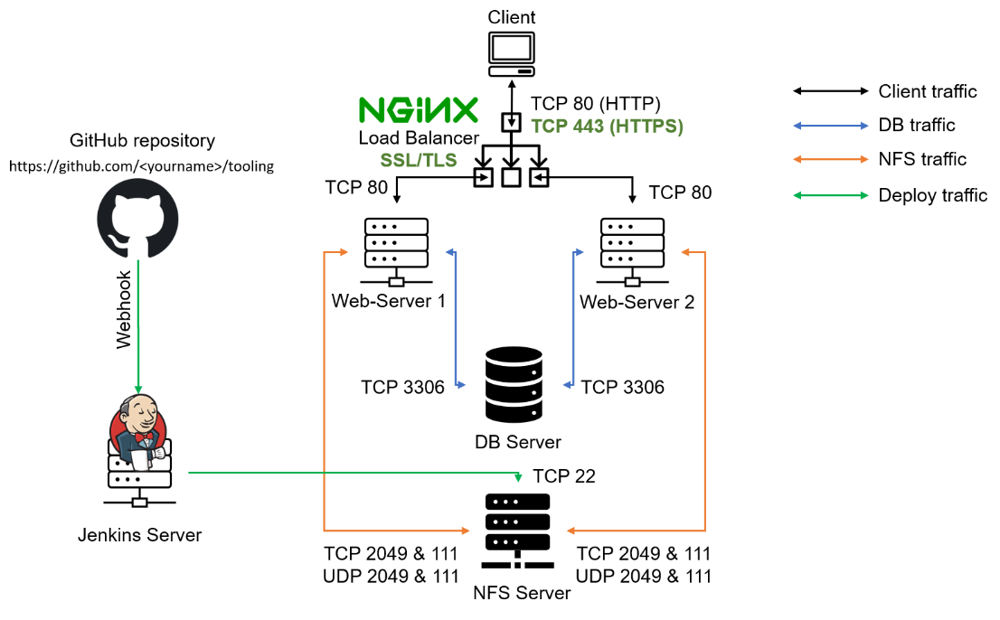

#
# LOAD BALANCER SOLUTIONWITH NGNIX AND SSL/TLS
### By now we learned what Load Balancing is used for and have configured an LB solution using APACHE, but a DevOps engineer must be a versatile professional and know different alternative solutions for the same problem. 
### That is why, in this project we will configure an [Nginx](https://www.nginx.com/) Load Balancer solution.
### It is also extremely important to ensure that connections to your Web solutions are secure and information is [encrypted in transit](https://security.berkeley.edu/data-encryption-transit-guideline) – we will also cover connection over secured HTTP (HTTPS protocol), its purpose and what is required to implement it.
### SECURITY: When data is moving between a client (browser) and a Web Server over the Internet – it passes through multiple network devices and, if the data is not encrypted, it can be relatively easy intercepted by someone who has access to the intermediate equipment. This kind of information security threat is called [Man-In-The-Middle (MIMT) attack](https://en.wikipedia.org/wiki/Man-in-the-middle_attack).
### This threat is real – users that share sensitive information (bank details, social media access credentials, etc.) via non-secured channels, risk their data to be compromised and used by [cybercriminals](https://www.trendmicro.com/vinfo/us/security/definition/cybercriminals).
### [SSL and its newer version, TSL](https://en.wikipedia.org/wiki/Secure_Sockets_Layer) – is a security technology that protects connection from MITM attacks by creating an encrypted session between browser and Web server. Here we will refer this family of cryptographic protocols as SSL/TLS – even though SSL was replaced by TLS, the term is still being widely used.
### SSL/TLS uses [digital certificates](https://en.wikipedia.org/wiki/Public_key_certificate) to identify and validate a Website. A browser reads the certificate issued by a [Certificate Authority (CA)](https://en.wikipedia.org/wiki/Certificate_authority) to make sure that the website is registered in the CA so it can be trusted to establish a secured connection.
### There are different types of SSL/TLS certificates – you can learn more about them [here](https://blog.hubspot.com/marketing/what-is-ssl). You can also watch a tutorial on how SSL works [here](https://youtu.be/T4Df5_cojAs) or an additional resource [here](https://youtu.be/SJJmoDZ3il8)
#
### In this project you will register your website with [LetsEnrcypt](https://letsencrypt.org/) Certificate Authority, to automate certificate issuance you will use a shell client recommended by LetsEncrypt – [cetrbot.](https://certbot.eff.org/)
#
## TASK
### This project consists of two parts:

### 1. Configure Nginx as a Load Balancer
### 2. Register a new domain name and configure secured connection using SSL/TLS certificates
### Your target architecture will look like this:

### Let's get started!
#
## CONFIGURE NGINX AS A LOAD BALANCER
### 1. Create an EC2 VM based on Ubuntu Server 20.04 LTS and name it Nginx LB (do not forget to open TCP port 80 for HTTP connections, also open TCP port 443 – this port is used for secured HTTPS connections)
### 2. Update /etc/hosts file for local DNS with Web Servers’ names (e.g. Web1 and Web2) and their local IP addresses
### 3. Install and configure Nginx as a load balancer to point traffic to the resolvable DNS names of the webservers
### - Update the instance and Install Nginx
### sudo apt update
### sudo apt install nginx
### - Configure Nginx LB using Web Server's names defined in the /etc/hosts

### - Open the default nginx configuration file
### sudo vi /etc/nginx/nginx.conf

### Restart Nginx and make sure the service is up and running
### sudo systemctl restart nginx
### sudo systemctl status nginx

## REGISTER A NEW DOMAIN NAME AND CONFIGURE SECURED CONNECTION USING SSL/TLS CERTIFICATES
### Let us make necessary configurations to make connections to our Tooling Web Solution secured!

### In order to get a valid SSL certificate – you need to register a new domain name, you can do it using any [Domain name](https://en.wikipedia.org/wiki/Domain_name_registrar) registrar – a company that manages reservation of domain names. The most popular ones are: [Godaddy.com](https://godaddy.com/), [Domain.com](https://www.domain.com/), [Bluehost.com](https://www.bluehost.com/).
### Create Record

### Create an Elastic IP address in AWS Console. To preserve the IP address after the machines are rebooted

### Allocate Elastic IP address

### Add a New tag

### Associate Elastic IP address

### Route 53 - Scalable DNS and Domain Name Registration

### Create hosted zone

### Open another AWS console window to go to Elastic IP addresses, to obtian the Allocated IPv4

### Records created

### 4. Configure Nginx to recognize your new domain name, Update your nginx.conf with
### server_name www.<your-domain-name.com> instead of server_name www.domain.com

### Restart Nginx service
### sudo systemctl restart nginx
### sudo systemctl status nginx

### 5. Install [certbot](https://certbot.eff.org/) and request for an SSL/TLS certificate

### Make sure [snapd](https://snapcraft.io/snapd) service is active and running

### Request your certificate (just follow the certbot instructions – you will need to choose which domain you want your certificate to be issued for, domain name will be looked up from nginx.conf file so make sure you have updated it on step 4).
### sudo ln -s /snap/bin/certbot /usr/bin/certbot
### sudo certbot --nginx

### Issue encountered during the request of certificate, it was resolved adding the Public IP address of NGINX server from AWS console. After that, the request of the certificate was succesfully

### Test secured access to your Web Solution by trying to reach https://<your-domain-name.com>

### You shall be able to access your website by using HTTPS protocol (that uses TCP port 443) and see a padlock pictogram in your browser’s search string.
### Click on the padlock icon and you can see the details of the certificate issued for your website.

### 6. Set up periodical renewal of your SSL/TLS certificate
### By default, LetsEncrypt certificate is valid for 90 days, so it is recommended to renew it at least every 60 days or more frequently.
### You can test renewal command in dry-run mode
### sudo certbot renew --dry-run

### Best pracice is to have a scheduled job that to run renew command periodically. Let us configure a cronjob to run the command twice a day.
### To do so, lets edit the crontab file with the following command:
### crontab -e
### Save changes
### You can always change the interval of this cronjob if twice a day is too often by adjusting schedule expression.

## Congratulations!
### You have just implemented an Nginx Load Balancing Web Solution with secured HTTPS connection with periodically updated SSL/TLS certificates.

