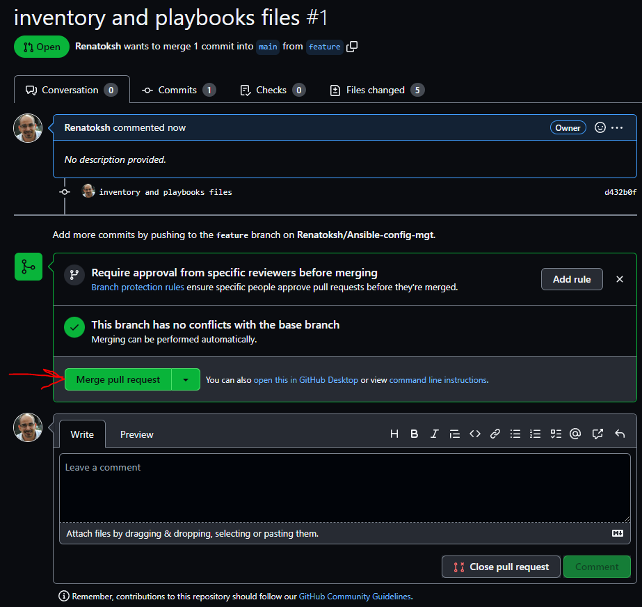

#
# ANSIBLE CONFIGURATION MANAGEMENT - AUTOMATE PROJECT 7 TO 10
## This Project will make you appreciate DevOps tools even more by making most of the routine tasks automated with [Ansible Configuration Management](https://en.wikipedia.org/wiki/Ansible_(software)), at the same time you will become confident at writing code using declarative language such as [YAML](https://en.wikipedia.org/wiki/YAML).
### Let's get started
## Ansible Client as a Jump Server (Bastion Host)
### A [Jump Server]https://en.wikipedia.org/wiki/Jump_server (sometimes also referred as [Bastion Host](https://en.wikipedia.org/wiki/Bastion_host)) is an intermediary server through which access to internal network can be provided. If you think about the current architecture you are working on, ideally, the webservers would be inside a secured network which cannot be reached directly from the Internet. That means, even DevOps engineers cannot SSH into the Web servers directly and can only access it through a Jump Server – it provide better security and reduces [attack surface](https://en.wikipedia.org/wiki/Attack_surface).

### On the diagram below the Virtual Private Network (VPC) is divided into [two subnets](https://docs.aws.amazon.com/vpc/latest/userguide/VPC_Subnets.html) – Public subnet has public IP addresses and Private subnet is only reachable by private IP addresses.

### When you reach Project 15, you will see a Bastion host in proper action. But for now, we will develop Ansible scripts to simulate the use of a Jump box/Bastion host to access our Web Servers.
## Task
### Install and configure Ansible client to act as a Jump Server/Bastion Host
### Create a simple Ansible playbook to automate servers configuration
## INSTALL AND CONFIGURE ANSIBLE ON EC2 INSTANCE
### 1. Update Name tag on your Jenkins EC2 Instance to Jenkins-Ansible. We will use this server to run playbooks.

### 2. In your GitHub account create a new repository and name it [ansible-config-mgt](https://github.com/Renatoksh/Ansible-config-mgt.git).
### 3. Install Ansible
### sudo apt update
### sudo apt install ansible

### 4. Configure Jenkins build job to save your repository content every time you change it – this will solidify your Jenkins configuration skills acquired in Project 9.
### - Create a new Freestyle project ansible in Jenkins and point it to your ‘ansible-config-mgt’ repository.
### - Configure Webhook in GitHub and set webhook to trigger ansible build.
### - Configure a Post-build job to save all (**) files, like you did it in Project 9.

### 5. Test your setup by making some change in README.MD file in master branch and make sure that builds starts automatically and Jenkins saves the files (build artifacts) in following folder
### ls /var/lib/jenkins/jobs/ansible/builds/<build_number>/archive/

### Note: Trigger Jenkins project execution only for /main branch.
### Now your setup will look like this:

### Tip Every time you stop/start your Jenkins-Ansible server – you have to reconfigure GitHub webhook to a new IP address, in order to avoid it, it makes sense to allocate an Elastic IP to your Jenkins-Ansible server (you have done it before to your LB server in Project 10). Note that Elastic IP is free only when it is being allocated to an EC2 Instance, so do not forget to release Elastic IP once you terminate your EC2 Instance.
## Step 2 – Prepare your development environment using Visual Studio Code
### 1. First part of ‘DevOps’ is ‘Dev’, which means you will require to write some codes and you shall have proper tools that will make your coding and debugging comfortable – you need an Integrated development environment (IDE) or Source-code Editor. There is a plethora of different IDEs and Source-code Editors for different languages with their own advantages and drawbacks, you can choose whichever you are comfortable with, but we recommend one free and universal editor that will fully satisfy your needs – Visual Studio Code (VSC), you can get it here.
### 2. After you have successfully installed VSC, configure it to connect to your newly created GitHub repository.
### 3. Clone down your ansible-config-mgt repo to your Jenkins-Ansible instance
### git clone <ansible-config-mgt repo link>

### Step 4 – Set up an Ansible Inventory
### An Ansible inventory file defines the hosts and groups of hosts upon which commands, modules, and tasks in a playbook operate. Since our intention is to execute Linux commands on remote hosts, and ensure that it is the intended configuration on a particular server that occurs. It is important to have a way to organize our hosts in such an Inventory.
### Save below inventory structure in the inventory/dev file to start configuring your development servers. Ensure to replace the IP addresses according to your own setup.
### Note: Ansible uses TCP port 22 by default, which means it needs to ssh into target servers from Jenkins-Ansible host – for this you can implement the concept of ssh-agent. Now you need to import your key into ssh-agent:
### To learn how to setup SSH agent and connect VS Code to your Jenkins-Ansible instance, please see this video:
### For Windows users – ssh-agent on windows
### For Linux users – ssh-agent on linux
### eval `ssh-agent -s`

### ssh-add <path-to-private-key>

### Confirm the key has been added with the command below, you should see the name of your key
### ssh-add -l

### Now, ssh into your Jenkins-Ansible server using ssh-agent

### Update your inventory/dev.yml file with this snippet of code:

## CREATE A COMMON PLAYBOOK
### Step 5 – Create a Common Playbook
### It is time to start giving Ansible the instructions on what you needs to be performed on all servers listed in inventory/dev.
### In common.yml playbook you will write configuration for repeatable, re-usable, and multi-machine tasks that is common to systems within the infrastructure.
### Update your playbooks/common.yml file with following code:

### Examine the code above and try to make sense out of it. This playbook is divided into two parts, each of them is intended to perform the same task: install wireshark utility (or make sure it is updated to the latest version) on your RHEL 8 and Ubuntu servers. It uses root user to perform this task and respective package manager: yum for RHEL 8 and apt for Ubuntu.
### Feel free to update this playbook with following tasks:
### - Create a directory and a file inside it
### - Change timezone on all servers
### - Run some shell script
### …
### For a better understanding of Ansible playbooks – [watch this video from RedHat](https://youtu.be/ZAdJ7CdN7DY) and read [this article](https://www.redhat.com/en/topics/automation/what-is-an-ansible-playbook).
### Step 6 – Update GIT with the latest code
### Now all of your directories and files live on your machine and you need to push changes made locally to GitHub.
### In the real world, you will be working within a team of other DevOps engineers and developers. It is important to learn how to collaborate with help of GIT. In many organisations there is a development rule that do not allow to deploy any code before it has been reviewed by an extra pair of eyes – it is also called "Four eyes principle".
### Now you have a separate branch, you will need to know how to raise a Pull Request (PR), get your branch peer reviewed and merged to the master branch.
### Commit your code into GitHub:
### use git commands to add, commit and push your branch to GitHub.
### git status

### git add <selected files>

### git commit -m "commit message"

### git push origin feature

### 2. Create a Pull request (PR)

### Once your code changes appear in master branch – Jenkins will do its job and save all the files (build artifacts) to /var/lib/jenkins/jobs/ansible/builds/<build_number>/archive/ directory on Jenkins-Ansible server.
### Create another project "ansible-copy"

### Build Steps

### create folder on ubuntu's home and grant permissions

### Build now ansible project

## RUN FIRST ANSIBLE TEST
### Now, it is time to execute ansible-playbook command and verify if your playbook actually works:
### cd ansible-config-mgt
### ansible-playbook -i inventory/dev.yaml playbooks/common.yaml

### You can go to each of the servers and check if wireshark has been installed by running which wireshark or wireshark --version

### We updated with Ansible architecture now looks like this:

### Congratulations
### We have just automated your routine tasks by implementing your first Ansible project! There is more exciting projects ahead, so lets keep it moving!

