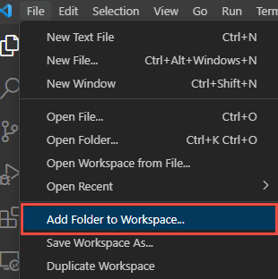
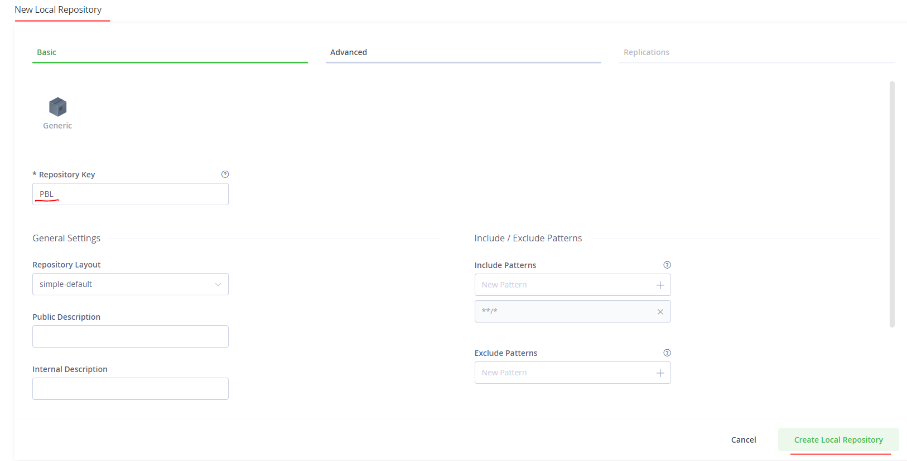
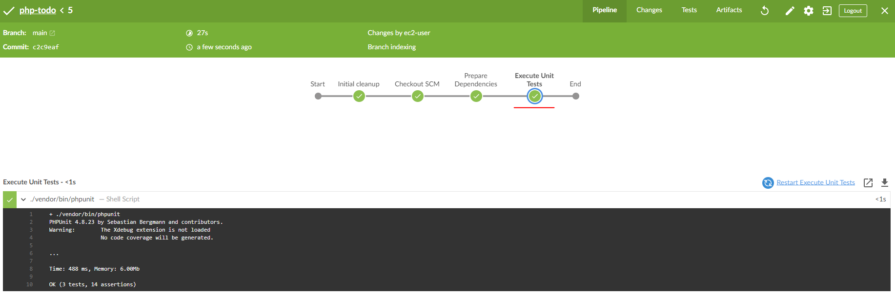
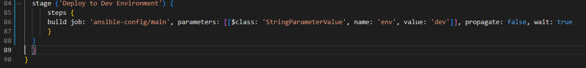

#
# EXPERIENCE CONTINUOUS INTEGRATION WITH JENKINS | ANSIBLE | ARTIFACTORY | SONARQUBE | PHP
### IMPORTANT NOTICE – This project has some initial theoretical concepts that must be well understood before moving on to the practical part. Please read it carefully as many times as needed to completely digest the most important and fundamental DevOps concepts. To successfully implement this project, it is crucial to grasp the importance of the entire CI/CD process, roles of each tool and success metrics – so we encourage you to thoroughly study the following theory until you feel comfortable explaining all the concepts (e.g., to your new junior colleague or during a job interview).
### In previous projects, you have been deploying a tooling website directly into the MARKDOWN_HASH40d1b2d83998fabacb726e5bc3d22129MARKDOWNHASH directory on dev servers. Well, even though that worked fine, and we were able to access the website, it is not the best way to do it. Real world web application code written on [Java](https://en.wikipedia.org/wiki/Java(programming_language)), [.NET](https://en.wikipedia.org/wiki/.NET_Framework) or other compiled programming languages require a build stage to create an executable file. The executable file (e.g., jar file in case of Java) contains all the codes embedded, and the necessary library dependencies, which the application needs to run and work successfully.
### Some other programs written languages such as [PHP](https://en.wikipedia.org/wiki/PHP), [JavaScript](https://en.wikipedia.org/wiki/JavaScript) or [Python](https://en.wikipedia.org/wiki/Python_(programming_language)) work directly without being built into an executable file – these languages are called interpreted. That is why we could easily deploy the entire code from git into var/www/html and immediately the webserver was able to render the pages in a browser. However, it is not optimal to download code directly from Git onto our servers. There is a smarter way to package the entire application code, and track release versions. We can package the entire code and all its dependencies into an archive such as .tar.gz or .zip, so that it can be easily unpacked on a respective environment’s servers.
### For a better understanding of the difference between compiled vs interpreted programming languages – read [this short article](https://www.freecodecamp.org/news/compiled-versus-interpreted-languages/).
### In this project, you will understand and get hands on experience around the entire concept around CI/CD from applications perspective. To fully gain real expertise around this idea, it is best to see it in action across different programming languages and from the platform perspective too. From the application perspective, we will be focusing on [PHP](https://en.wikipedia.org/wiki/PHP) here; there are more projects ahead that are based on Java, Node.js, .Net and Python. By the time you start working on Terraform, Docker and Kubernetes projects, you will get to see the platform perspective of CI/CD in action.
### What is Continuous Integration?
### In software engineering, Continuous Integration (CI) is a practice of merging all developers’ working copies to a shared mainline (e.g., Git Repository or some other version control system) several times per day. Frequent merges reduce chances of any conflicts in code and allow to run tests more often to avoid massive rework if something goes wrong. This principle can be formulated as Commit early, push often.
### The general idea behind multiple commits is to avoid what is generally considered as Merge Hell or Integration hell. When a new developer joins a new project, he or she must create a copy of the main codebase by starting a new feature branch from the mainline to develop his own features (in some organization or team, this could be called a develop, main or master branch). If there are tens of developers working on the same project, they will all have their own branches created from mainline at different points in time. Once they make a copy of the repository it starts drifting away from the mainline with every new merge of other developers’ codes. If this lingers on for a very long time without reconciling the code, then this will cause a lot of code conflict or Merge Hell, as rightly said. Imagine such a hell from tens of developers or worse, hundreds. So, the best thing to do, is to continuously commit & push your code to the mainline. As many times as tens times per day. With this practice, you can avoid Merge Hell or Integration hell.
#
# fill in information
#
#
#
#
#


# ANSIBLE ROLES FOR CI ENVIRONMENT
### 1. Create Ec2 instance for Jenkins-Ansible server
### Now go ahead and Add two more roles to ansible:
### 1. [SonarQube](https://www.sonarqube.org/) (Scroll down to the Sonarqube section to see instructions on how to set up and configure SonarQube manually)
### 2. [Artifactory](https://jfrog.com/artifactory/)
### Why do we need SonarQube?
### SonarQube is an open-source platform developed by SonarSource for continuous inspection of code quality, it is used to perform automatic reviews with static analysis of code to detect bugs, [code smells](https://en.wikipedia.org/wiki/Code_smell), and security vulnerabilities. [Watch a short description here](https://youtu.be/vE39Fg8pvZg). There is a lot more hands on work ahead with SonarQube and Jenkins. So, the purpose of SonarQube will be clearer to you very soon.
### Why do we need Artifactory?
### Artifactory is a product by [JFrog](https://jfrog.com/) that serves as a binary repository manager. The binary repository is a natural extension to the source code repository, in that the outcome of your build process is stored. It can be used for certain other automation, but we will it strictly to manage our build artifacts.
### [Watch a short description here](https://youtu.be/upJS4R6SbgM) Focus more on the first 10.08 mins
1. ### INSTALL JENKINS
### I. install git 
### sudo yum install git -y
### II. Clone https://github.com/Renatoksh/ansible-config.git
### git clone https://github.com/Renatoksh/ansible-config.git
### III. install Jenkins
### sudo su -
### [Intalling Kenins](https://www.jenkins.io/doc/book/installing/)
### Go to Linux section and Redhat-CentOS distribution
### install wget
### yum install wget -y
### Reference: [here](https://www.jenkins.io/doc/book/installing/)
### run the command:
### sudo wget -O /etc/yum.repos.d/jenkins.repo \
###     https://pkg.jenkins.io/redhat-stable/jenkins.repo

###  sudo rpm --import https://pkg.jenkins.io/redhat-stable/jenkins.io.key
### sudo yum upgrade

#### Add required dependencies for the jenkins package
### sudo install -y https://dl.fedoraproject.org/pub/epel/epel-release-latest-9.noarch.rpm
### sudo yum install -y dnf-utils http://rpms.remirepo.net/enterprise/remi-release-9.rpm
### sudo yum install java-11-openjdk-devel -y
### Open the bash profile
### vi .bash_profile

### Reload the bash profile
### source ~/.bash_profile
### exit sudo user, to use ec2user
### type in exit in the terminal  to logout of the root user

### sudo yum install jenkins

### sudo systemctl start jenkins
### sudo systemctl enable jenkins
### sudo systemctl status jenkins

### sudo systemctl daemon-reload
## Jenkins has been installed succesfully!!!
### Open a web browser and access to Jenkins with your <PublicIPaddress>:8080 
### Unlock Jenkins

### Install plugins

### Install Ocean plugin


### Click in Open Blue Ocean and Create a new Pipeline

### click in GitHub

### Create an access token


### Select your project and then create a pipeline
### Click in Administration to go back to Jenkins interface

### Create a new directory "deploy" and a new file "JenkinsFile"

### Add the code snippet below to start building the Jenkinsfile gradually. This pipeline currently has just one stage called Build and the only thing we are doing is using the shell script module to echo Building Stage

### Now go back into the Ansible pipeline in Jenkins, and select configure


### Back to the pipeline again, this time click "Build now"

### This will trigger a build and you will be able to see the effect of our basic Jenkinsfile configuration by going through the console output of the build.
### To really appreciate and feel the difference of Cloud Blue UI, it is recommended to try triggering the build again from Blue Ocean interface.
### 1. Click on Blue Ocean

### 2. Select your project
### 3. Click on the play button against the branch

### Notice that this pipeline is a multibranch one. This means, if there were more than one branch in GitHub, Jenkins would have scanned the repository to discover them all and we would have been able to trigger a build for each branch.
### Let us see this in action.
### Create a new git branch and name it feature/jenkinspipeline-stages

### Commit and push changes to GitHub project

### To make your new branch show up in Jenkins, we need to tell Jenkins to scan the repository.
### 1. Click on the "Administration" button

### 2. Navigate to the Ansible project and click on "Scan repository now"

### 3. Refresh the page and both branches will start building automatically. You can go into Blue Ocean and see both branches there too.

### 4. In Blue Ocean, you can now see how the Jenkinsfile has caused a new step in the pipeline launch build for the new branch.

## A QUICK TASK FOR YOU!
### 1. Create a pull request to merge the latest code into the main branch


### 2. After merging the PR, go back into your terminal and switch into the main branch.
### 3. Pull the latest change.
### 4. Create a new branch, add more stages into the Jenkins file to simulate below phases. (Just add an echo command like we have in build and test stages)
###   1. Package 
###   2. Deploy 
###   3. Clean up
### 5. Verify in Blue Ocean that all the stages are working, then merge your feature branch to the main branch
### 6. Eventually, your main branch should have a successful pipeline like this in blue ocean

#
## RUNNING ANSIBLE PLAYBOOK FROM JENKINS
### Now that you have a broad overview of a typical Jenkins pipeline. Let us get the actual Ansible deployment to work by:
### 1. Installing Ansible on Jenkins
### sudo yum install ansible -y

### yum install python3 python3-pip wget unzip git -y
### python3 -m pip install --upgrade setuptools
### python3 -m pip install --upgrade pip
### python3 -m pip install mysql-connector-python
### python3 -m pip install psycopg2==2.7.5 --ignore-installed or pip install psycopg2-binary (reference: [here](https://pypi.org/project/psycopg2/))
### ansible-galaxy collection install community.postgresql
### 2. Installing Ansible plugin in Jenkins UI

### 3. Creating Jenkinsfile from scratch. (Delete all you currently have in there and start all over to get Ansible to run successfully)
### Clone your repository (Use the Pipeline syntax option: To generate Pipeline script)


### Prepare Ansible for Execution

### Run Ansible playbook


### Clean Workspace after build

### Add private IP address to inventory>dev file
### 1. Create a new Ec2 instance (Redhat) - Nginx
### 2. Create a new EC2 instance (Ubuntu) - db

### Update Playbook>site.yml file

### for now update the file main.yml

### You can [watch a 10 minutes video here](https://youtu.be/PRpEbFZi7nI) to guide you through the entire setup
### Possible issues to watch out for when you implement this
### 1. Remember that ansible.cfg must be exported to environment variable so that Ansible knows where to find Roles. But because you will possibly run Jenkins from different git branches, the location of Ansible roles will change. Therefore, you must handle this dynamically. You can use Linux Stream Editor sed to update the section roles_path each time there is an execution. You may not have this issue if you run only from the main branch.
###  2. If you push new changes to Git so that Jenkins failure can be fixed. You might observe that your change may sometimes have no effect. Even though your change is the actual fix required. This can be because Jenkins did not download the latest code from GitHub. Ensure that you start the Jenkinsfile with a clean up step to always delete the previous workspace before running a new one. Sometimes you might need to login to the Jenkins Linux server to verify the files in the workspace to confirm that what you are actually expecting is there. Otherwise, you can spend hours trying to figure out why Jenkins is still failing, when you have pushed up possible changes to fix the error.
### 3. Another possible reason for Jenkins failure sometimes, is because you have indicated in the Jenkinsfile to check out the main git branch, and you are running a pipeline from another branch. So, always verify by logging onto the Jenkins box to check the workspace, and run git branch command to confirm that the branch you are expecting is there.

### If everything goes well for you, it means, the Dev environment has an up-to-date configuration. But what if we need to deploy to other environments?
### Are we going to manually update the Jenkinsfile to point inventory to those environments? such as sit, uat, pentest, etc.
### Or do we need a dedicated git branch for each environment, and have the inventory part hard coded there.
### Think about those for a minute and try to work out which one sounds more like a better solution.
### Manually updating the Jenkinsfile is definitely not an option. And that should be obvious to you at this point. Because we try to automate things as much as possible.
### Well, unfortunately, we will not be doing any of the highlighted options. What we will be doing is to parameterise the deployment. So that at the point of execution, the appropriate values are applied.

### Now create a pull request to main branch and run ansible playbook

#
## CI/CD PIPELINE FOR TODO APPLICATION
### We already have tooling website as a part of deployment through Ansible. Here we will introduce another PHP application to add to the list of software products we are managing in our infrastructure. The good thing with this particular application is that it has unit tests, and it is an ideal application to show an end-to-end CI/CD pipeline for a particular application.
### Our goal here is to deploy the application onto servers directly from Artifactory rather than from git. If you have not updated Ansible with an Artifactory role, simply use this guide to create an Ansible role for Artifactory (ignore the Nginx part). [Configure Artifactory on Ubuntu 20.04](https://www.howtoforge.com/tutorial/ubuntu-jfrog/)
## Phase 1 – Prepare Jenkins
### 1. Fork the repository below into your GitHub account
### https://github.com/darey-devops/php-todo.git
### git clone https://github.com/Renatoksh/php-todo.git

### Add Folder to Workspace


### 2. On you Jenkins server, install PHP, its dependencies and [Composer tool](https://getcomposer.org/) (Feel free to do this manually at first, then update your Ansible accordingly later)
### as root user (sudo su -) execute the following commands
### yum module reset php -y
### yum module enable php:remi-7.4 -y
### yum install -y php  php-common php-mbstring php-opcache php-intl php-xml php-gd php-curl php-mysqlnd    php-fpm php-json
### systemctl start php-fpm
### systemctl enable php-fpm
### systemctl status php-fpm

#### Install composer
### curl -sS https://getcomposer.org/installer | php 
### sudo mv composer.phar /usr/bin/composer
### composer ---version

### Install Jenkins plugins
### 1. [Plot plugin](https://plugins.jenkins.io/plot/)

### 2. [Artifactory plugin](https://www.jfrog.com/confluence/display/JFROG/Jenkins+Artifactory+Plug-in)


### We will use plot plugin to display tests reports, and code coverage information.
### The Artifactory plugin will be used to easily upload code artifacts into an Artifactory server.
### In Jenkins UI configure Artifactory
### Create a new EC2 instance for Artifactory
### update the ci file with the private IP addres

### Updated site.yml from Playbooks folder

#### Note: ci(inventorty directory), site.tml (playbooks directory) and artifactory.yml (static-assignments directory) should have the same name "artifactory" in this case.
### commit and push changes to main branch 
### git status
### git add .
### git commit -m "message"
### git push
### Go you your Jenkins web interface - ansible - main, and click in Build with Parameters


### Opent artifactory web
### http://public_ip_address:8082
#### Note: Make sure your EC2 instance has added the security group with port 8082; username: admin, Password:password (by default)


### skip set base url
### skip configure default proxy
### skip create repositories
### click in finish

### Create a local repository



### In Jenkins UI configure Artifactory

### Configure the server ID, URL and Credentials, run Test Connection.

#
## Phase 2 – Integrate Artifactory repository with Jenkins
### 1. Create a dummy Jenkinsfile in the repository

### 2. Using Blue Ocean, create a multibranch Jenkins pipeline


### 3. On the database server, create database and user
#### Create database homestead;
#### CREATE USER 'homestead'@'%' IDENTIFIED BY 'sePret^i';
#### GRANT ALL PRIVILEGES ON * . * TO 'homestead'@'%';
### Edit files accordingly


### commit and push changes to gitub


### Update the database connectivity requirements in the file .env.sample
### issue encountered

### Solution: Install mysql on Jenkins server
### sudo yum install mysql
### access to the db server to set the bind address
### sudo vi /etc/mysql/mysql.conf.d/mysqld.cnf (such as we did in project 5)


### update the connection inside your php to do file
### DB_CONNECTION=mysql
### DB_PORT=3306
### Update Jenkinsfile with proper pipeline configuration
### short reminder: Security groups added with port 3306
### remote connection should looks like this:

### Commit and push the changes to php-todo github project
### run php-todo project in your Jenkins server and open your Open your Blue Ocean

### 1. Update the Jenkinsfile to include Unit tests step

### commit and push the changes in Php-todo project to github
### Unit Test with Open Blue Ocean after the commit and push

#
## Phase 3 – Code Quality Analysis
### This is one of the areas where developers, architects and many stakeholders are mostly interested in as far as product development is concerned. As a DevOps engineer, you also have a role to play. Especially when it comes to setting up the tools.
### For PHP the most commonly tool used for code quality analysis is [phploc](https://phpqa.io/projects/phploc.html). [Read the article here for more](https://matthiasnoback.nl/2019/09/using-phploc-for-quick-code-quality-estimation-part-1/)
### 1. The data produced by phploc can be ploted onto graphs in Jenkins.
### Add the code analysis step in Jenkinsfile. The output of the data will be saved in build/logs/phploc.csv file.

### Install phpunit, phploc
### Run the command inside php-todo directory
### [https://phpqa.io/projects/phploc.html](https://phpqa.io/projects/phploc.html)
### sudo dnf --enablerepo=remi install php-phpunit-phploc
### run the commands one previous directory php-todo
### wget -O phpunit https://phar.phpunit.de/phpunit-7.phar
### chmod +x phpunit

### Commit and push changes to run the php-todo pipeline in Jenkins
### Run the php-todo project
### error message

### Solution to code analysis error: [here](https://phpqa.io/projects/phploc.html)
### run again the project php-todo: It works!!! this time

### 2. Plot the data using plot Jenkins plugin.
### This plugin provides generic plotting (or graphing) capabilities in Jenkins. It will plot one or more single values variations across builds in one or more plots. Plots for a particular job (or project) are configured in the job configuration screen, where each field has additional help information. Each plot can have one or more lines (called data series). After each build completes the plots’ data series latest values are pulled from the CSV file generated by phploc.
### You should now see a Plot menu item on the left menu. Click on it to see the charts. (The analytics may not mean much to you as it is meant to be read by developers. So, you need not worry much about it – this is just to give you an idea of the real-world implementation).

### 3. Bundle the application code for into an artifact (archived package) upload to Artifactory
### 4. Publish the resulted artifact into Artifactory 
### It is required to install zip application first:
### sudo yum install zip -y


### note: commit and push changes to github php-todo project
### Deploy the application to the dev environment by launching Ansible pipeline


### 5. Deploy the application to the dev environment by launching Ansible pipeline
### Create a new EC2 instance for todo server (RedHat)
### Update in ansible project the site-yml, dev and deployment.yml files. Commit and push changes to github project after changes are applied.


### Update the Jenkins file in the php-todo project. Commit and push changes to github project after changes are applied.

### results


### The build job used in this step tells Jenkins to start another job. In this case it is the ansible-project job, and we are targeting the main branch. Hence, we have ansible-project/main. Since the Ansible project requires parameters to be passed in, we have included this by specifying the parameters section. The name of the parameter is env and its value is dev. Meaning, deploy to the Development environment.
### But how are we certain that the code being deployed has the quality that meets corporate and customer requirements? Even though we have implemented Unit Tests and Code Coverage Analysis with phpunit and phploc, we still need to implement Quality Gate to ensure that ONLY code with the required code coverage, and other quality standards make it through to the environments.
### To achieve this, we need to configure SonarQube – An open-source platform developed by SonarSource for continuous inspection of code quality to perform automatic reviews with static analysis of code to detect bugs, code smells, and security vulnerabilities.
#
## SONARQUBE INSTALLATION
### Before we start getting hands on with SonarQube configuration, it is incredibly important to understand a few concepts:
### [Software Quality](https://en.wikipedia.org/wiki/Software_quality) – The degree to which a software component, system or process meets specified requirements based on user needs and expectations.
### [Software Quality Gates](https://docs.sonarqube.org/latest/user-guide/quality-gates/) – Quality gates are basically acceptance criteria which are usually presented as a set of predefined quality criteria that a software development project must meet in order to proceed from one stage of its lifecycle to the next one.
### SonarQube is a tool that can be used to create quality gates for software projects, and the ultimate goal is to be able to ship only quality software code.
### Despite that DevOps CI/CD pipeline helps with fast software delivery, it is of the same importance to ensure the quality of such delivery. Hence, we will need SonarQube to set up Quality gates. In this project we will use predefined Quality Gates (also known as [The Sonar Way](https://docs.sonarqube.org/latest/instance-administration/quality-profiles/)). Software testers and developers would normally work with project leads and architects to create custom quality gates.
## Install SonarQube on Ubuntu 20.04 With PostgreSQL as Backend Database
### Here is a manual approach to installation. Ensure that you can to automate the same with Ansible.
### Below is a step by step guide how to install SonarQube 7.9.3 version. It has a strong prerequisite to have Java installed since the tool is Java-based. MySQL support for SonarQube is deprecated, therefore we will be using PostgreSQL.
### - Create a new EC2 ubuntu 20.04 instances
### We will make some Linux Kernel configuration changes to ensure optimal performance of the tool – we will increase vm.max_map_count, file discriptor and ulimit.
### Tune Linux Kernel
### This can be achieved by making session changes which does not persist beyond the current session terminal.
### Update site.yml and ci files 

### Add roles configuration roles into the ansible.cfg file

### install postgresql
### ex

### Installation and Configuration, running the ansible playbook


## Access SonarQube
### To access SonarQube using browser, type server’s IP address followed by port 9000
### Note. Add the security group the port 9000 in the AWS console 
### http://server_IP:9000 OR http://localhost:9000
### Login to SonarQube with default administrator username and password – admin

### Now, when SonarQube is up and running, it is time to setup our Quality gate in Jenkins.
#
## CONFIGURE SONARQUBE AND JENKINS FOR QUALITY GATE
### - In Jenkins, install [SonarScanner plugin](https://docs.sonarqube.org/latest/analysis/scan/sonarscanner-for-jenkins/)


### - Navigate to configure system in Jenkins. Add SonarQube server as shown below:
### Manage Jenkins > Configure System

### Generate authentication token in SonarQube
### User > My Account > Security > Generate Tokens

### Configure Quality Gate Jenkins Webhook in SonarQube – The URL should point to your Jenkins server http://{JENKINS_HOST}/sonarqube-webhook/


### Setup SonarQube scanner from Jenkins – Global Tool Configuration
### Manage Jenkins > Global Tool Configuration

## Update Jenkins Pipeline to include SonarQube scanning and Quality Gate
### Below is the snippet for a Quality Gate stage in Jenkinsfile.

### Commit and push changes
### NOTE: The above step will fail because we have not updated `sonar-scanner.properties
### Configure sonar-scanner.properties – From the step above, Jenkins will install the scanner tool on the Linux server. You will need to go into the tools directory on the server to configure the properties file in which SonarQube will require to function during pipeline execution.
### cd /var/lib/jenkins/tools/hudson.plugins.sonar.SonarRunnerInstallation/SonarQubeScanner/conf/
### Open sonar-scanner.properties file
### sudo vi sonar-scanner.properties

### HINT: To know what exactly to put inside the sonar-scanner.properties file, SonarQube has a configurations page where you can get some directions.

### A brief explanation of what is going on the the stage – set the environment variable for the scannerHome use the same name used when you configured SonarQube Scanner from Jenkins Global Tool Configuration. If you remember, the name was SonarQubeScanner. Then, within the steps use shell to run the scanner from bin directory.
### To further examine the configuration of the scanner tool on the Jenkins server – navigate into the tools directory
### cd /var/lib/jenkins/tools/hudson.plugins.sonar.SonarRunnerInstallation/SonarQubeScanner/bin
### List the content to see the scanner tool sonar-scanner. That is what we are calling in the pipeline script.
### Output of ls -latr

### So far you have been given code snippets on each of the stages within the Jenkinsfile. But, you should also be able to generate Jenkins configuration code yourself.
### To generate Jenkins code, navigate to the dashboard for the php-todo pipeline and click on the Pipeline Syntax menu item
### Dashboard > php-todo > Pipeline Syntax 

### Click on Steps and select withSonarQubeEnv – This appears in the list because of the previous SonarQube configurations you have done in Jenkins. Otherwise, it would not be there.
### Within the generated block, you will use the sh command to run shell on the server. For more advanced usage in other projects, you can add to bookmarks this [SonarQube documentation page](https://docs.sonarqube.org/latest/analysis/scan/sonarscanner-for-jenkins/) in your browser.
## End-to-End Pipeline Overview
### Indeed, this has been one of the longest projects from Project 1, and if everything has worked out for you so far, you should have a view like below:

### There are bugs, and there is 0.0% code coverage. (code coverage is a percentage of unit tests added by developers to test functions and objects in the code)
### If you click on php-todo project for further analysis, you will see that there is 6 hours’ worth of technical debt, code smells and security issues in the code.

### In the development environment, this is acceptable as developers will need to keep iterating over their code towards perfection. But as a DevOps engineer working on the pipeline, we must ensure that the quality gate step causes the pipeline to fail if the conditions for quality are not met.
## Conditionally deploy to higher environments
### In the real world, developers will work on feature branch in a repository (e.g., GitHub or GitLab). There are other branches that will be used differently to control how software releases are done. You will see such branches as:
### Develop
### Master or Main
### (The * is a place holder for a version number, Jira Ticket name or some description. It can be something like Release-1.0.0)
### Feature/*
### Release/*
### Hotfix/*
### The complete stage will now look like this:
```
 stage('SonarQube Quality Gate') {
     when { branch pattern: "^develop*|^hotfix*|^release*|^main*", comparator: "REGEXP"}
        environment {
            scannerHome = tool 'SonarQubeScanner'
        }
        steps {
            withSonarQubeEnv('sonarqube') {
                sh "${scannerHome}/bin/sonar-scanner -Dproject.settings=sonar-project.properties"
            }
            timeout(time: 1, unit: 'MINUTES') {
                waitForQualityGate abortPipeline: true
            }
        }
    }
```
### job failed

### to resolve this error, we need to install npm
### sudo yum install npm -y
### install xdebug
### sudo yum install php-xdebug
### run the command
### php --ini | grep xdebug

### Edit xdebug.ini file
### vi /etc/php.d/15-xdebug.ini
### update the line "xdebug.mode = develop" by "xdebug.mode = coverage" and save the file
### restart service php-fpm
### sudo systemctl restart php-fpm


#
## VIDEO DEMO PIPELINE RUNNING
#
[](https://user-images.githubusercontent.com/95065208/217701545-c9b82e6d-627a-4179-89b0-3379ab742685.mp4)
#
