#
# WEB Stack Implementation (LEMP Stack)

### In this project you will implement a similar stack, but with an alternative Web Server – NGINX, which is also very popular and widely used by many websites in the Internet.
#
## Step 0 - Preparing prerequisites
## 1. Launch a new EC2 instance of t2.micro Family with Ubuntu Server 20.04 LTS
* [x] AWS free tier account and 
* [x] Create a new EC2 Instance of t2nano family with Ubuntu Server 22.04 LTS image
    * Note: Please refer to this [video] (https://www.youtube.com/watch?v=jsNIlK5s6pI) if you need to refresh your memory on how

#
# Step 1 - Installing the NGINX Web Server

### In order to display web pages to our site visitors, we are going to employ Nginx, a high-performance web server. We’ll use the apt package manager to install this package.
#
* [x] Installing the Nginx Web Server
    * sudo apt update
    * sudo apt install nginx
#
* [x] To verify that ngnix was succesfully installed and is running as a service in Ubuntu:
    * sudo systemctl status nginx
    * Result expected: 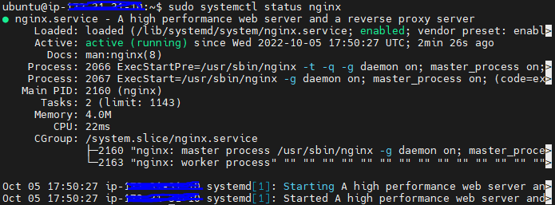
#
* [x] Add a rule to EC2 Instance configuration to open inbound TCP port 80
    * 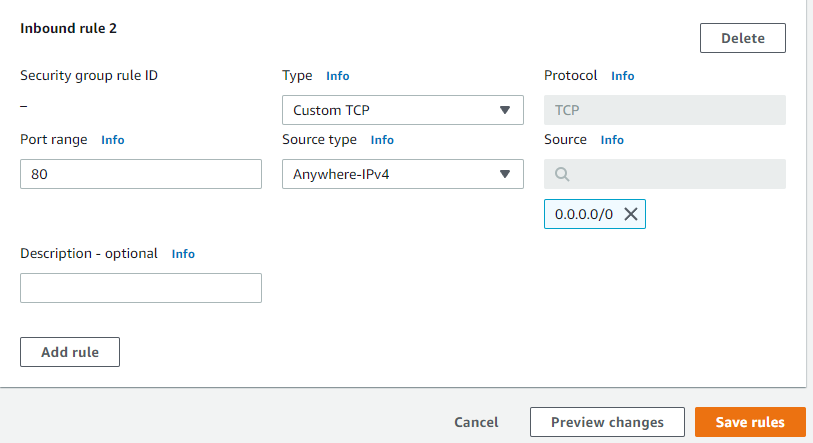
#
* [x] Access it locally in our Ubuntu shell
    * curl http://localhost:80 or curl http://127.0.0.1:80
    Result expected: 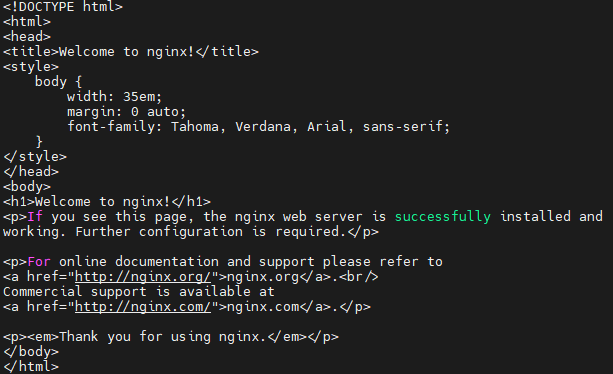
    * Note: The difference is that: in the first case we try to access our server via DNS name and in the second one – by IP address (in this case IP address 127.0.0.1 corresponds to DNS name ‘localhost’ and the process of converting a DNS name to IP address is called "resolution").
#
* [x] Testing how the Nginx server can respond to requests from the Internet
    * Open a browser of your choice and try to access following url
        * http://<Public-IP-Address>:80
        * Result expected: 
#
# Step 2 - Installing MySQL
### Now that you have a web server up and running (Nginx in step 1), you need to install a Database Management System (DBMS) to be able to store and manage data for your site in a relational database. MySQL is a popular relational database management system used within PHP environments, so we will use it in our project.
#
* [x] Use 'apt' to acquire and install this software
    * sudo apt install mysql-server
        * When propmted, confirm installation by typing Y, then ENTER
            * 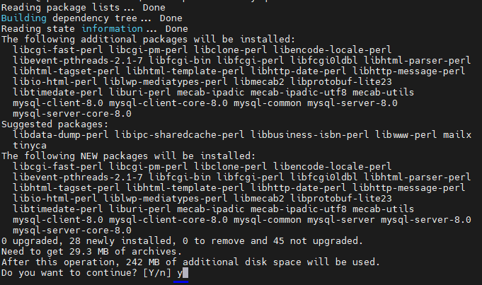
#
* [x] Log in the MySQL console by typing
    * sydo mysql
#
* [x] Run security Script that comes preinstalled with MySQL
    * This script will remove some insecure default settings and lock down access to your database system
    * ALTER USER 'root'@'localhost' IDENTIFIED WITH mysql_native_password BY 'PassWord.1';
    * Result expected: 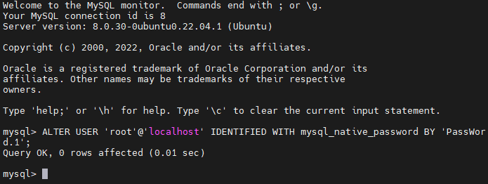
#
* [x] Exit the MySQL shell 
    * exit
#
* [x] Start interactive script by running:
    * sudo mysql_secure_installation
    * Result expected: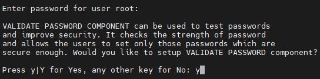
         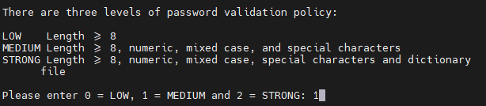 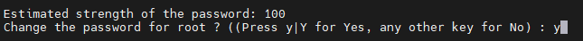 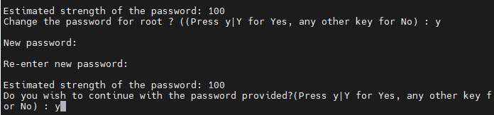
        * For the rest of the questions, press Y and hit the ENTER key at each prompt.
    * Result expected: 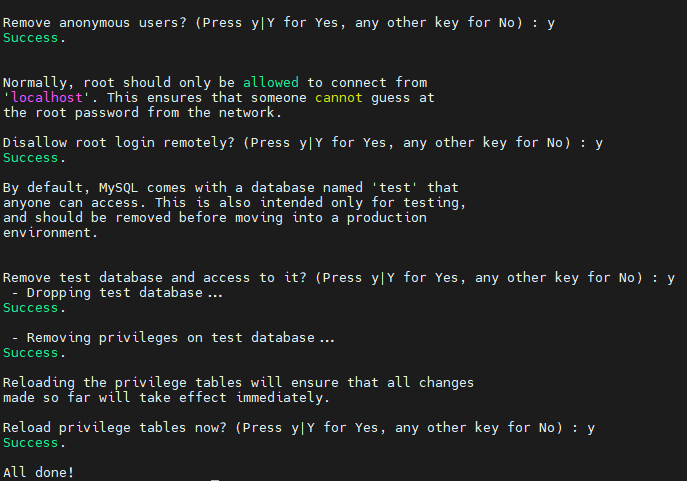
#
* [x] Test to logi in to the MySQL console 
    * sudo mysql -p
    * Results expected: 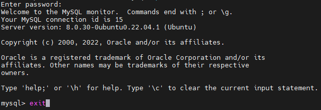
        * Note: Notice that you need to provide a password to connect as the root user.
        * For increased security, it’s best to have dedicated user accounts with less expansive privileges set up for every database, especially if you plan on having multiple databases hosted on your server.
    * The MySQL server is now installed and secured. Next, we will install PHP, the final component in the LEMP stack.
#
# Step 3. Installing PHP
### You have Nginx installed to serve your content and MySQL installed to store and manage your data. Now you can install PHP to process code and generate dynamic content for the web server.
### While Apache embeds the PHP interpreter in each request, Nginx requires an external program to handle PHP processing and act as a bridge between the PHP interpreter itself and the web server. This allows for a better overall performance in most PHP-based websites, but it requires additional configuration. You’ll need to install php-fpm, which stands for “PHP fastCGI process manager”, and tell Nginx to pass PHP requests to this software for processing. Additionally, you’ll need php-mysql, a PHP module that allows PHP to communicate with MySQL-based databases. Core PHP packages will automatically be installed as dependencies.
#
* [x] Install these 2 pacakges at once 
    * sudo apt install php-fmp php-mysql
    * Result expected: 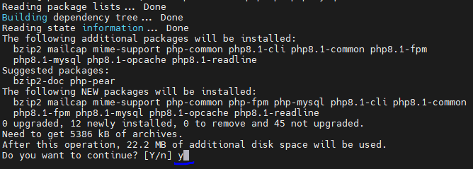
#
* We now have your PHP components installed. Next, you will configure Nginx to use them.
#
# Step 4 - Configuring Nginx to use PHP Processor
### When using the Nginx web server, we can create server blocks (similar to virtual hosts in Apache) to encapsulate configuration details and host more than one domain on a single server. In this guide, we will use projectLEMP as an example domain name.

### On Ubuntu 20.04, Nginx has one server block enabled by default and is configured to serve documents out of a directory at /var/www/html. While this works well for a single site, it can become difficult to manage if you are hosting multiple sites. Instead of modifying /var/www/html, we’ll create a directory structure within /var/www for the your_domain website, leaving /var/www/html in place as the default directory to be served if a client request does not match any other sites
#
* [x] Create the root web directory for your_domain
    * sudo mkdir /var/www/projectLEMP
#
* [x] Assign ownership of the directory with $USER environment variable, 
    * sudo chown -R $USER:$USER /var/www/projectLEMP
#
* [x] Open a new configuration file in Nginx's sites-available directory using your prerred command-line editor.
    * sudo nano /etc/nginx/sites-available/projectLEMP
    * Result expected: 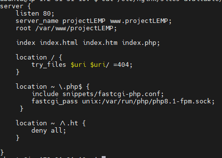
        * Listen -> Defines what port Nginx will listen on, the deafult port for HTTP
        * index -> Defines in which order Ngins will prioritize index files for the website.
        * server name -> Defines whic domain names / IP addreses this server block should respond for
        * location ->   If Nginx cannot find the appropriate resource, it will return a 404 error.
        * location ~ \.php$ -> This location block handles the actual PHP processing by pointing Nginx to the fastcgi-php
        * location ~ /\.ht -> The last location block deals with .htaccess files, which Nginx does not process
    * When you’re done editing, save and close the file
#
* [x] Activate your configuration by linking to the config file from Nginx’s sites-enabled
    * sudo ln -s /etc/nginx/sites-available/projectLEMP /etc/nginx/sites-enabled/
#
* [x] test your configuration for syntax errors by typing:
    * sudo nginx -t
    * Result expected: 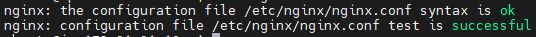
#
* [x] need to disable default Nginx host that is currently configured to listen on port 80
    * sudo unlink /etc/nginx/sites-enabled/default
#
* [x] Reload Nginx to apply the changes
    * sudo systemctl reload nginx
#
* [x] Create an index.html file in the location /var/www/projectLEMP, so that can be test that your new server block works as pected
    * sudo echo 'Hello LEMP from hostname' $(curl -s http://169.254.169.254/latest/meta-data/public-hostname) 'with public IP' $(curl -s http://169.254.169.254/latest/meta-data/public-ipv4) > /var/www/projectLEMP/index.html
    * Result expected: 
#
### Your LEMP stack is now fully configured. In the next step, we’ll create a PHP script to test that Nginx is in fact able to handle .php files within your newly configured website.
#
# Step 5 - Testing PHP with Nginx
### LEMP stack should now be completely set up. At this point, LEMP stack is coletely installed and fully operational
#
* [x] Creat a test PHP file in your document root
    * sudo nano /var/www/projectLEMP/info.php
    * Result expected: 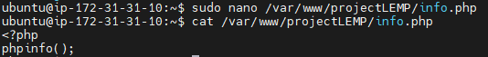 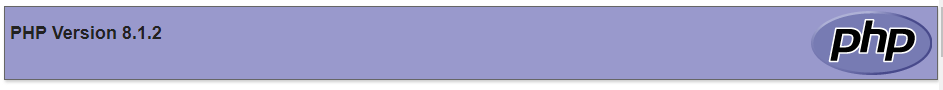
#
* [x] Remove the file you created as it contains sensitive information about your PHP environment and Ubuntu Server.
    * sudo rm /var/www/your_domain/info.php
    * We can always regenerate this file if you need it later
#
# Step 6 - Retrieving data from MySqL databse with PHP (Continued)
### In this step you will create a test database (DB) with simple "To do list" and configure access to it, so the Nginx website would be able to query data from the DB and display it.

* [x] create a database named example_database and a user named example_user, but you can replace these names with different values.
    * connect to the MySQL console using the root account
        * sudo mysql
#
* [x] To create a new database, run the following command from your MySQL console
    * CREATE DATABASE `test_db`;
    * Result expected: 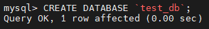
#
* [x] Create a new user and grant him full privileges on the database you have just created
    * CREATE USER 'testusql_user'@'%' IDENTIFIED WITH mysql_native_password BY 'PassWord.1';
    * Result expected: 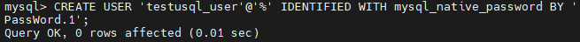
#
* [x] Give this user permission over the test_db database
    * GRANT ALL ON test_db.* TO 'testusql_user'@'%';
    * Result expected: 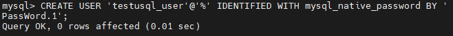
#
* [x] Test if the new user has proper permissions by logging in to the MySQL console again, this time usign the custom user credentials
    * mysql -u testusql_user -p
    * Results expected: 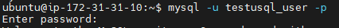
#
* [x] Confirm that you have access to the test_db database
    * mysql> SHOW DATABASES;
    * Result expected: 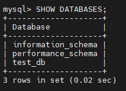
#
* [x] Create a test table named todo_list
    * 
#
* [x] Insert a few rows of content in the test table
    * 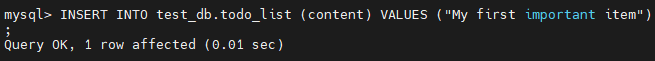
    * 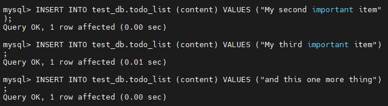
#
* [x] Confirm that the data was succesfully saved to your table
    * 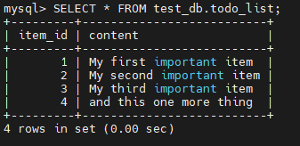
#
* [x] PHP script connects to the MySQL database and queries for the content of the todo_list table, displays the results in a list. If there is a problem with the database connection
    * 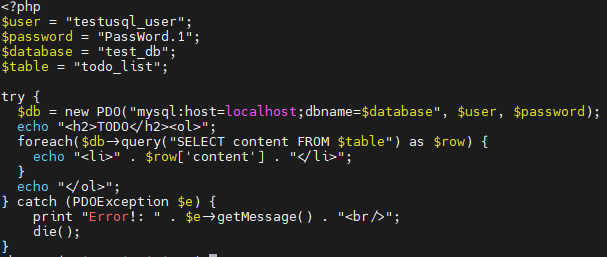
#
* [x] You can access this page in your web browser by http://<Public_domain_or_IP>/todo_list.php
    * Result expected 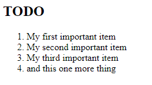
#
## Challenges: 
  ###  1. Investigate more about MySQL commands (https://www.w3schools.com/sql/default.asp)
  ###  2. Learn about MySQL was intensive, since it was my first ocasion to do this configuration, however it was great experience!!!
  ###  3. First time for me working with Nginx web server installations and configurations
  ###  4. Understand LAMP in AWS project 1 uses Apache web server, Project 2 uses Nginx web server for LEMP implementation
#

## That means your PHP environment is ready to connect and interact with your MySQL server.

## Congratulations!
 ###  In this guide, we have built a flexible foundation for serving PHP websites and applications to your visitors, using Nginx as web server and MySQL as database management system

