#
# SIMPLE TO-DO APPLICATION ON MERN WEB STACK
#
## STEP 1. backend configuration
## In this project, you are tasked to implement a web solution based on MERN stack in AWS Cloud.
#
## MERN Web stack consists of following components:
#
### 1. MongoDB: A document-based, No-SQL database used to store application data in a form of documents.

### 2. ExpressJS: A server side Web Application framework for Node.js.

### 3. ReactJS: A frontend framework developed by Facebook. It is based on JavaScript, used to build User Interface (UI) components.

#### 4. Node.js: A JavaScript runtime environment. It is used to run JavaScript on a machine rather than in a browser.
#

## Description

### As shown on the illustration above, a user interacts with the ReactJS UI components at the application front-end residing in the browser. This frontend is served by the application backend residing in a server, through ExpressJS running on top of NodeJS.
### Any interaction that causes a data change request is sent to the NodeJS based Express server, which grabs data from the MongoDB database if required, and returns the data to the frontend of the application, which is then presented to the user.
#
## Side Self Study
1. To be able to  explain the difference between Relational DBMS and NoSQL (of a different kind) (https://www.guru99.com/sql-vs-nosql.html)
2. Get Familiar with a concept of Web Application Frameworks, get to know what server-side (backend) and client-side (forntend) frameworks exist and what they are used for. (https://en.wikipedia.org/wiki/Web_framework)
3. [Practice basic JavaScript syntax just for fun](https://www.w3schools.com/js/js_intro.asp)
4. Explore what [RESTful API](https://restfulapi.net/) is and what it is used for in Web development.
5. Read what Cascading [Style Sheets (CSS)](https://en.wikipedia.org/wiki/CSS) is used for and browse [basic syntax and properties](https://www.w3schools.com/css/css_intro.asp).

#
## Step 0 - Preparing prerequisites
* AWS accountand a Virtual Server with Ubuntu Server OS
#
## Task
### To deploy a simple To-Do application that creates ToDo lists like following

#
## Step 1 - BACKEND CONFIGURATION
* [x] Update Ubuntu
    * sudo apt update
* [x] Upgrade Ubuntu
    * sudo apt upgrde
        * 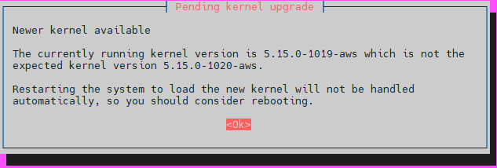
        ## * Note: for mistake I chose Ubuntu 22.04, I had to start from scrash using Ubuntu 20.04 version, did not get this message.
* [x] Lets get the location of Node.js software from Ubuntu repositories.
    * curl -fsSL https://deb.nodesource.com/setup_18.x | sudo -E bash -
    * 
* [x] Install Node.js on the server. Install Node.js with the following command
    * sudo apt-get install -y nodejs
    * 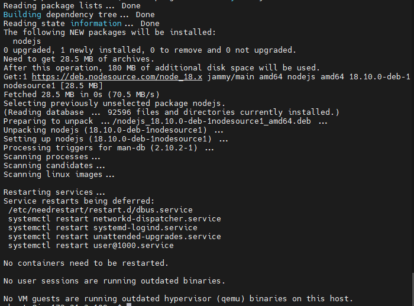
    
# * Note: The command above installs both nodejs and npm. NPM is a package manager for Node like apt for Ubuntu, it is used to install Node modules & packages and to manage dependency conflicts.

* [x] Verify the node installation with the command below
    * node -v
    * 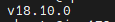
* [x] Verify the node installation with the command below
    * npm -v
    * 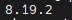
#
### Application Code Setup
* [x] Create a new directory for your To-Do project
    * mkdir Todo
    ### * TIP: In order to see some more useful information about files and directories, you can use following combination of keys ls -lih – it will show you different properties and size in human readable format. You can learn more about different useful keys for ls command with ls --help.
    * Now change your current directory to the newly created one
        * cd Todo
*[x] Next, you will use the command npm init to initialise your project, so that a new file named package.json will be created. This file will normally contain information about your application and the dependencies that it needs to run. Follow the prompts after running the command. You can press Enter several times to accept default values, then accept to write out the package.json file by typing yes.
    * npm init
    * 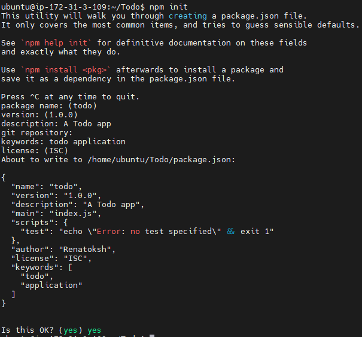
    * ls command
        * 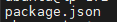
#
## INSTALL EXPRESSJS
* [x] Install ExpressJS
### Remember that Express is a framework for Node.js, therefore a lot of things developers would have programmed is already taken care of out of the box. Therefore it simplifies development, and abstracts a lot of low level details. For example, Express helps to define routes of your application based on HTTP methods and URLs.

* [x] To use express, install it using npm
    * npm install express
    * 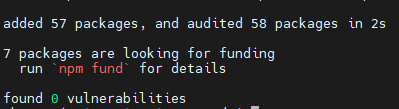
* [x] Now create a file index.js with the command 
    * touch index.js
    * Install dotenv module
        * 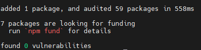
    * vim index.js
    * Type the code below
        *   const express = require('express');
            require('dotenv').config();

            const app = express();

            const port = process.env.PORT || 5000;

            app.use((req, res, next) => {
            res.header("Access-Control-Allow-Origin", "\*");
            res.header("Access-Control-Allow-Headers", "Origin, X-Requested-With, Content-Type, Accept");
            next();
            });

            app.use((req, res, next) => {
            res.send('Welcome to Express');
            });

            app.listen(port, () => {
            console.log(`Server running on port ${port}`)
            });
        * 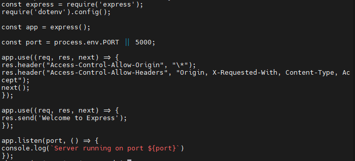
        * Notice that we have specified to use port 5000 in the code. This will be required later when we go on the browser.
* [x] Now it is time to start our server to see if it works
    * node index,js
    * 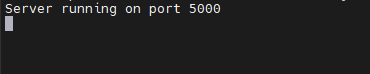
    * There we created an inbound rule to open TCP port 80, you need to do the same for port 5000, like this:
        * 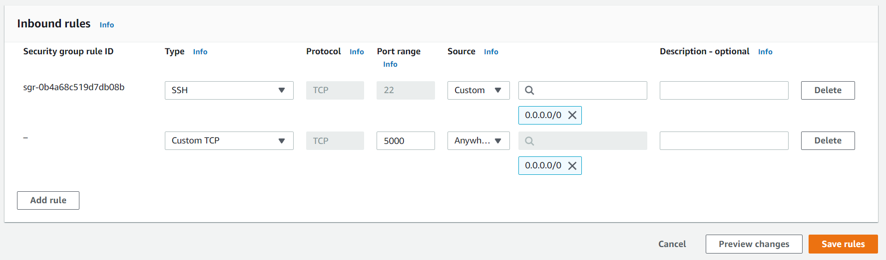
        * 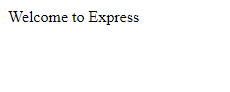

#
## Routes 
There are three actions that our To-Do application needs to be able to do:
* Create a new task
* Display list of all tasks
* Delete a completed task

### Each task will be associated with some particular endpoint and will use different standard HTTP request methods: POST, GET, DELETE.

* [x] For each task, we need to create routes that will define various endpoints that the To-do app will depend on. So let us create a folder routes
    * mkdir routes
    * cd routes
* [x] Create a file api.js
    * touch api.js
* [x] Open the file and edit it
    * vim api.js
    *   const express = require ('express');
        const router = express.Router();

        router.get('/todos', (req, res, next) => {

        });

        router.post('/todos', (req, res, next) => {

        });

        router.delete('/todos/:id', (req, res, next) => {

        })

        module.exports = router;
#
# MODELS
### Now comes the interesting part, since the app is going to make use of Mongodb which is a NoSQL database, we need to create a model.

### A model is at the heart of JavaScript based applications, and it is what makes it interactive.

### We will also use models to define the database schema . This is important so that we will be able to define the fields stored in each Mongodb document. (Seems like a lot of information, but not to worry, everything will become clear to you over time. I promise!!!)

### In essence, the Schema is a blueprint of how the database will be constructed, including other data fields that may not be required to be stored in the database. These are known as virtual properties

### To create a Schema and a model, install mongoose which is a Node.js package that makes working with mongodb easier.

* [x] Install Mongoose
    * npm install mongoose
    * 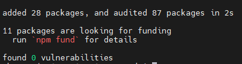
* Creat a new folder
    * mkdir models
    * cd models
* Create a file todo.js
    * 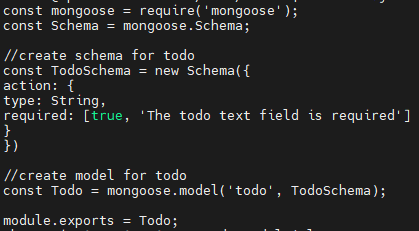
* [x] change directory to routes adn edit api.js
    *   const express = require ('express');
        const router = express.Router();
        const Todo = require('../models/todo');

        router.get('/todos', (req, res, next) => {

        //this will return all the data, exposing only the id and action field to the client
        Todo.find({}, 'action')
        .then(data => res.json(data))
        .catch(next)
        });

        router.post('/todos', (req, res, next) => {
        if(req.body.action){
        Todo.create(req.body)
        .then(data => res.json(data))
        .catch(next)
        }else {
        res.json({
        error: "The input field is empty"
        })
        }
        });

        router.delete('/todos/:id', (req, res, next) => {
        Todo.findOneAndDelete({"_id": req.params.id})
        .then(data => res.json(data))
        .catch(next)
        })

        module.exports = router;
#
# MONGODB DATABASE
### For this we will make use of mLab. mLab provides MongoDB database as a service solution (DBaaS), so to make life easy, you will need to sign up for a shared clusters free account, which is ideal for our use case. [Sign up here](https://www.mongodb.com/atlas-signup-from-mlab). 
* [x] Follow the sign up process, select AWS as the cloud provider, and choose a region near you.
    * 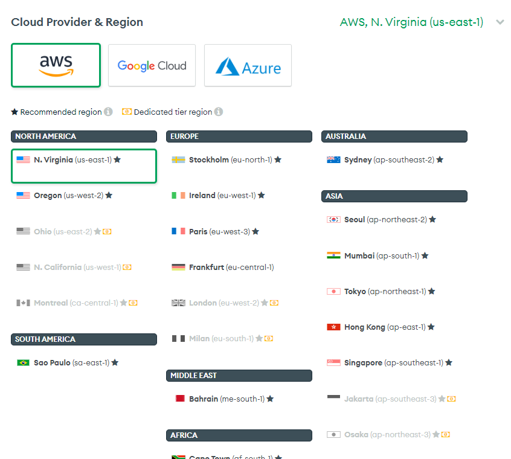
    * 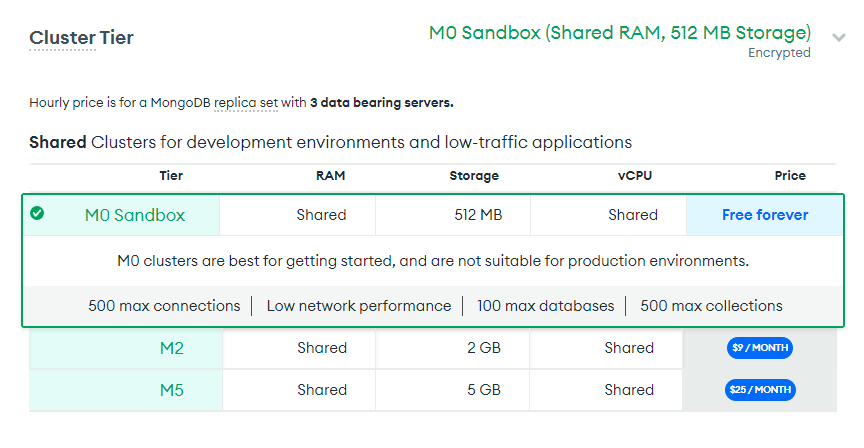
    * 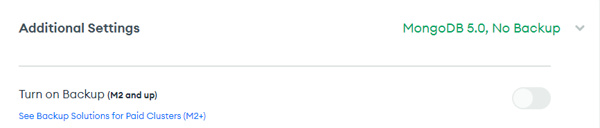
    * 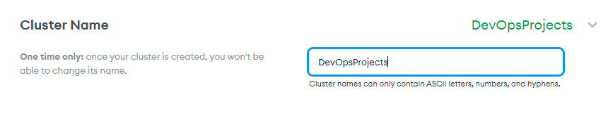
    * 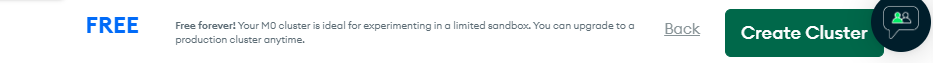
    * Remove the default Ip address and then create a newly one 
    * 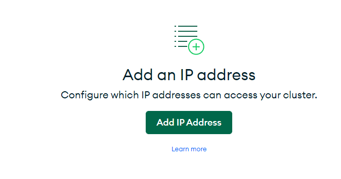
    * 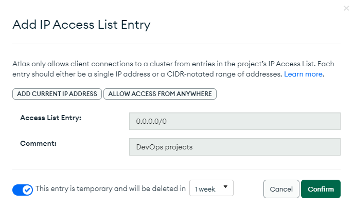
    * 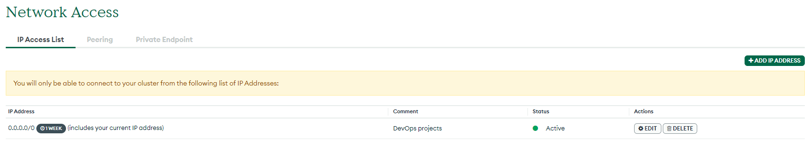
    * Connect To [DevOpsProjects](https://downloads.mongodb.com/compass/mongosh-1.6.0-win32-x64.zip) 
    * or command line mongosh "mongodb+srv://devopsprojects.0ypirb0.mongodb.net/myFirstDatabase" --apiVersion 1 --username renatoksh
* [x] Create a MongoDB database and collection inside mLab
    * 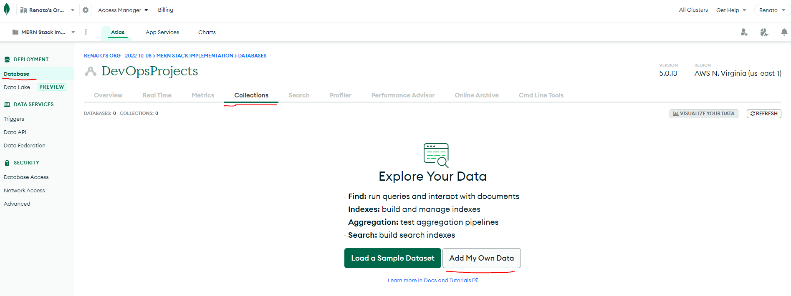
### In the index.js file, we specified process.env to access environment variables, but we have not yet created this file. So we need to do that at this point.
* [x] Create a file in your Todo directory and name it .env.
    * touch .env
    * vi .env
    * Add the command string to access the database in it
        *  mongodb+srv://renatoksh:<password>@devopsprojects.0ypirb0.mongodb.net/?retryWrites=true&w=majority
        * Ensure to update <username>, <password>, <network-address> and <database> according to your setup
        * 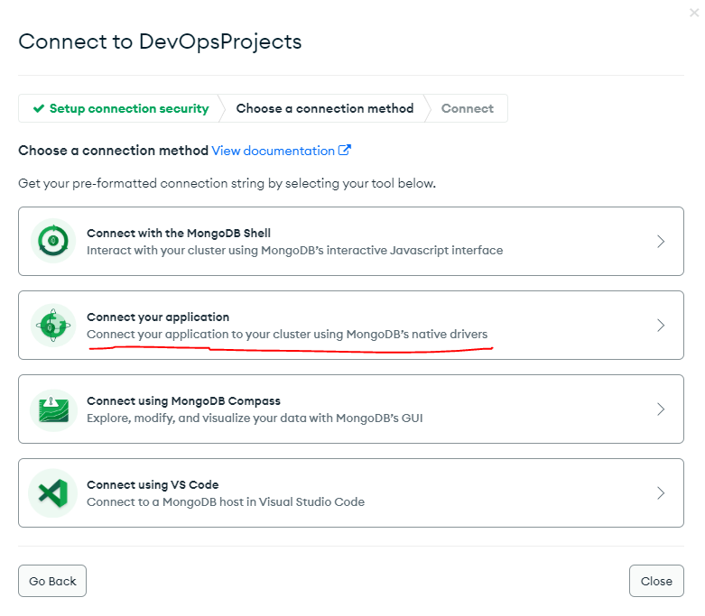
        * 
#
### Now we need to update the index.js to reflect the use of .env so that Node.js can connect to the database.
### Simply delete existing content in the file, and update it with the entire code below.

* [x] Use vim or vi, follow below steps
    * Open the file with vim index.js
    * Press esc key
    * Type :%d
    * Hit 'ENTER' key
        * The entire content will be deleted, then,
    * Press i to enter the insert mode vim
    * Now, paste the entire content below in the file:
        const express = require('express');
        const bodyParser = require('body-parser');
        const mongoose = require('mongoose');
        const routes = require('./routes/api');
        const path = require('path');
        require('dotenv').config();

        const app = express();

        const port = process.env.PORT || 5000;

        //connect to the database
        mongoose.connect(process.env.DB, { useNewUrlParser: true, useUnifiedTopology: true })
        .then(() => console.log(`Database connected successfully`))
        .catch(err => console.log(err));

        //since mongoose promise is depreciated, we overide it with node's promise
        mongoose.Promise = global.Promise;

        app.use((req, res, next) => {
        res.header("Access-Control-Allow-Origin", "\*");
        res.header("Access-Control-Allow-Headers", "Origin, X-Requested-With, Content-Type, Accept");
        next();
        });

        app.use(bodyParser.json());

        app.use('/api', routes);

        app.use((err, req, res, next) => {
        console.log(err);
        next();
        });

        app.listen(port, () => {
        console.log(`Server running on port ${port}`)
        });
    * Error found
        
    ### How was resolved the issue:
    * 1) Add Database name 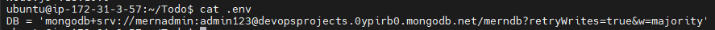 
    * 2) Kill node process 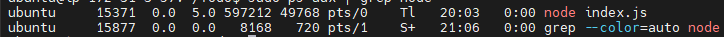
    * 3) 

### Testing Backend Code witout Frontend using RESTful API
### So far we have written backend part of our To-Do application, and configured a database, but we do not have a frontend UI yet. We need ReactJS code to achieve that. But during development, we will need a way to test our code using RESTfulL API. Therefore, we will need to make use of some API development client to test our code.
* ![x] Install [Posman](https://www.postman.com/downloads/) to test our API
* ![x] Open POSTMAN, create a POST request to the API http://<PublicIP-or-PublicDNS>:5000/api/todos
    * This request sends a new task to our ToDo list so the application could store it in the database
    * test all the API endpoints and make sure they are working. For the endpoints that require body, you should send JSON back with the necessary fields since it’s what we setup in our code.
    ### Create a POST
    * Make sure your set header key Content-Type as application/json
    * 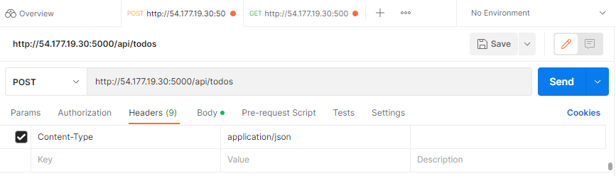
    * Check the image below:
    * 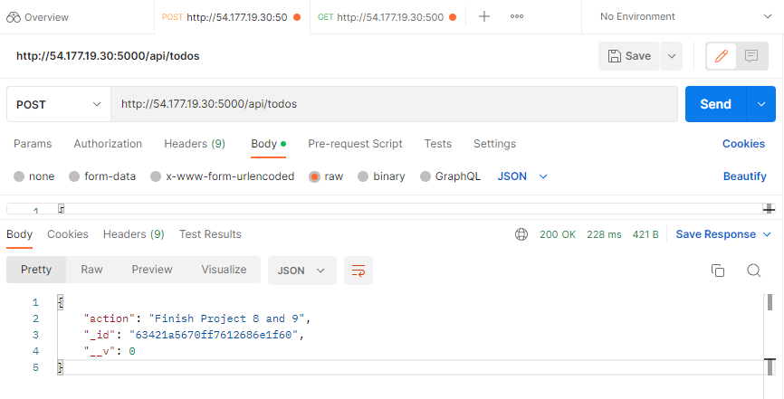
    ### Create a GET
    * 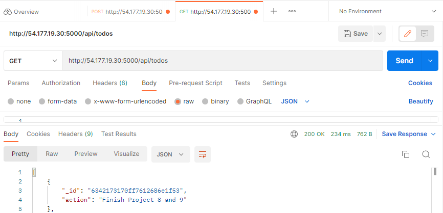
#
### Optional task: Try to figure out how to send a DELETE request to delete a task from out To-Do list.
### Hint: To delete a task – you need to send its ID as a part of DELETE request.
### By now you have tested backend part of our To-Do application and have made sure that it supports all three operations we wanted:

* ![x] Display a list of tasks – HTTP GET request
    * 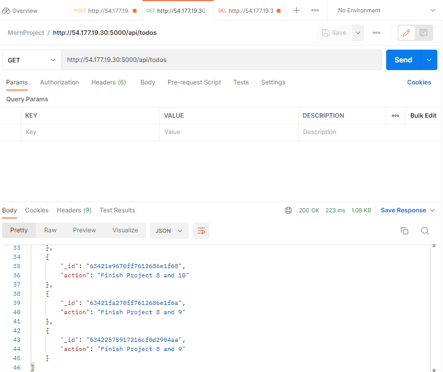
* ![x] Add a new task to the list – HTTP POST request
    * 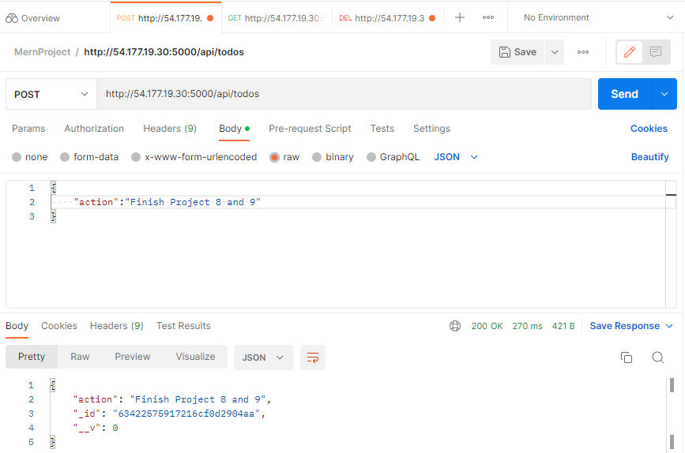
* ![x] Delete an existing task from the list – HTTP DELETE request
    * 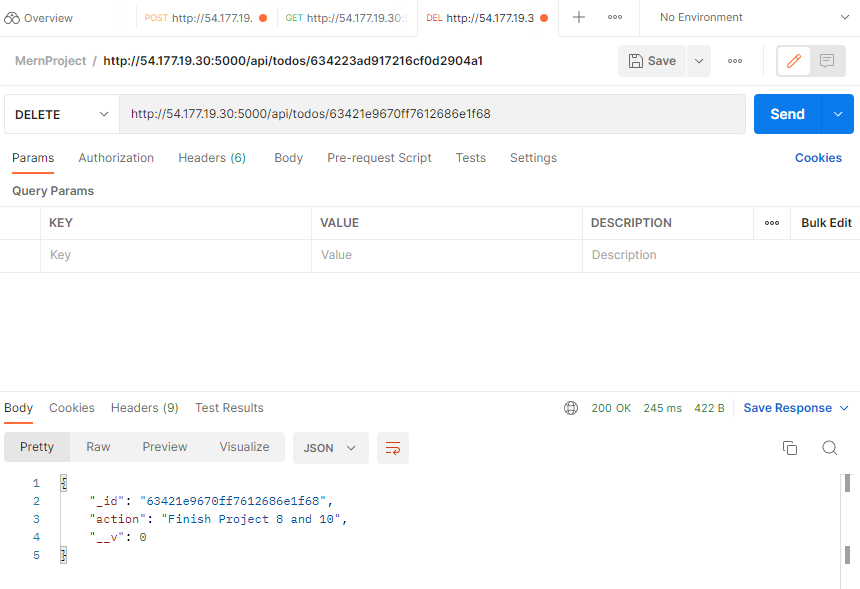
    * 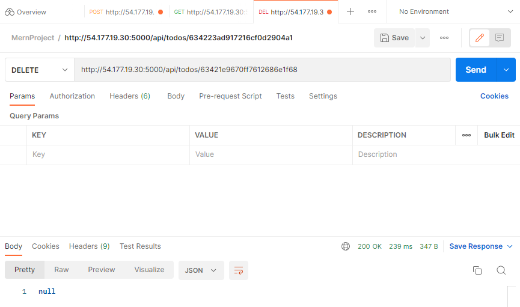

## You have successfully created our Backend, now let go create the Frontend.
#
## STEP 2. frontend creation
### Since we are done with the functionality we want from our backend and API, it is time to create a user interface for a Web client (browser) to interact with the application via API. To start out with the frontend of the To-do app, we will use the create-react-app command to scaffold our app.

* ![x] In the same root directory as your backend code, which is the Todo directory
    *  npx create-react-app client 
    *  This will crate a new folder in your Todo directory called 'client', where will be added all the react code
    * 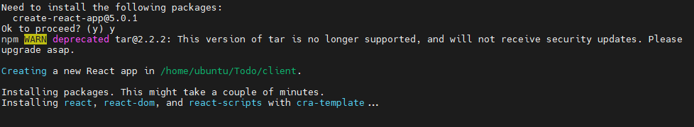
#
### Running a React App
### Before testing the react app, there are some dependencies that need to be installed
*![1] Install concurrently. It is used to run more that one command simultaneously from the same terminal window
* 1) npm install concurrently --save-dev
    * 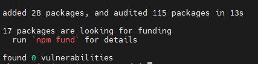
* 2. Install nodemon. It is used to run and monitor the server. If there is any change in the server code, nodemon will restart it automatically and load the new changes.
    * npm install nodemon --save-dev
    * 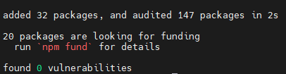
* 3. In Todo folder open the package.json file. Change the highlithted part below screenshot and replace with the code below
    * vi or vim pacjage.json
    * 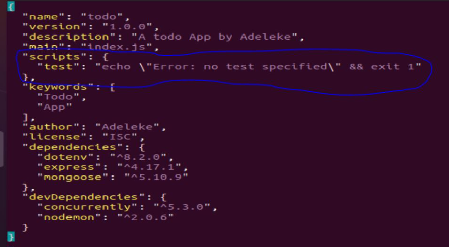
    * 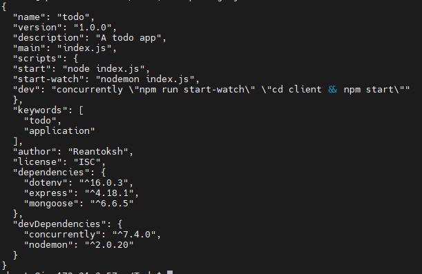
#
### Configure Proxy in "package.json"
* 1) Change directory to client and open "package.json"file
    * cd client
    * vi package.json
    * 
* 2) Add the key value pair in the package.json file "proxy": "http://localhost:5000"
### The whole purpose of adding the proxy configuration in number 3 above is to make it possible to access the application directly from the browser by simply calling the server url like http://localhost:5000 rather than always including the entire path like http://localhost:5000/api/todos
* ensure you are inside the Todo directory, and simply run follwoing comand
    * npm run dev
    * 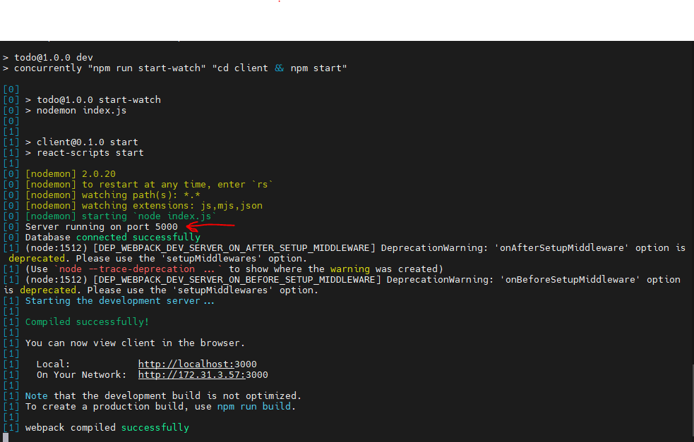
    * Open TCP port 3000 on EC2 by adding a new Security Group rule
#
### Creaing your React Components
* [x] change directory to client/src
    * cd client/src
* Create "components" directory and move into "components " directory
* Create 3 files called: "Input.js" "ListTodo.js" "Todo.js"
* Open Input.js and insert code:
    *   import React, { Component } from 'react';
        import axios from 'axios';

        class Input extends Component {

        state = {
        action: ""
        }

        addTodo = () => {
        const task = {action: this.state.action}

            if(task.action && task.action.length > 0){
            axios.post('/api/todos', task)
                .then(res => {
                if(res.data){
                    this.props.getTodos();
                    this.setState({action: ""})
                }
                })
                .catch(err => console.log(err))
            }else {
            console.log('input field required')
            }

        }

        handleChange = (e) => {
        this.setState({
        action: e.target.value
        })
        }

        render() {
        let { action } = this.state;
        return (
        

        <input type="text" onChange={this.handleChange} value={action} />
        <button onClick={this.addTodo}>add todo</button>
        

        )
        }
        }

        export default Input
*  Move to client directory "cd ..", "cd .." 
* Install Axios
    * npm install axios
    * 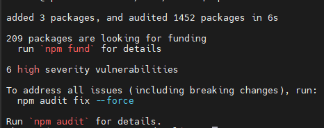

#
## FRONTEND CREATION (CONTINUED)

* Go to "comoponents" directory
    * cd src/components
* Open "ListTodo.js" file and isert code
    *   import React from 'react';
        const ListTodo = ({ todos, deleteTodo }) => {

        return (
        <ul>
        {
        todos &&
        todos.length > 0 ?
        (
        todos.map(todo => {
        return (
        <li key={todo._id} onClick={() => deleteTodo(todo._id)}>{todo.action}</li>
        )
        })
        )
        :
        (
        <li>No todo(s) left</li>
        )
        }
        </ul>
        )
        }

        export default ListTodo
* Open "Todo.js" file and insert code:
 *  import React, {Component} from 'react';
    import axios from 'axios';

    import Input from './Input';
    import ListTodo from './ListTodo';

    class Todo extends Component {

    state = {
    todos: []
    }

    componentDidMount(){
    this.getTodos();
    }

    getTodos = () => {
    axios.get('/api/todos')
    .then(res => {
    if(res.data){
    this.setState({
    todos: res.data
    })
    }
    })
    .catch(err => console.log(err))
    }

    deleteTodo = (id) => {

        axios.delete(`/api/todos/${id}`)
        .then(res => {
            if(res.data){
            this.getTodos()
            }
        })
        .catch(err => console.log(err))

    }

    render() {
    let { todos } = this.state;

        return(
        

            <h1>My Todo(s)</h1>
            <Input getTodos={this.getTodos}/>
            <ListTodo todos={todos} deleteTodo={this.deleteTodo}/>
        

        )

    }
    }

    export default Todo;
* Go to scr directory 
    * cd ..
    * Copy and paste the code
        * 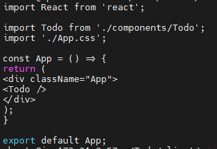
* Open and edit App.css file
    * vi App.css
    * Code App.css
* Open and insert code in index.css from scr directory
    * vi index.css
    * 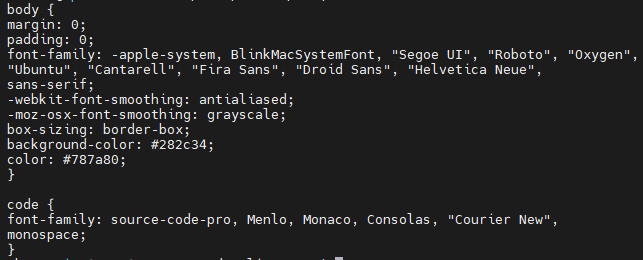

# Challenges:
* Recognize the importance of the proper distribution and version for your project as part of the prerequisites and dependencies available and working properly for software and applications to be installed on the Server
* Mongoose configuration problems and missing information of db name in the string, and node process killed to resolved the issue encountered

### Assuming no errors when saving all these files, our To-Do app should be ready and fully functional with the functionality discussed earlier: creating a task, deleting a task and viewing all your tasks.
* 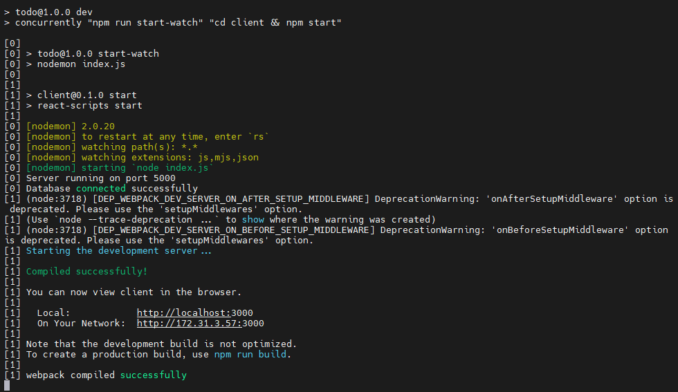
* 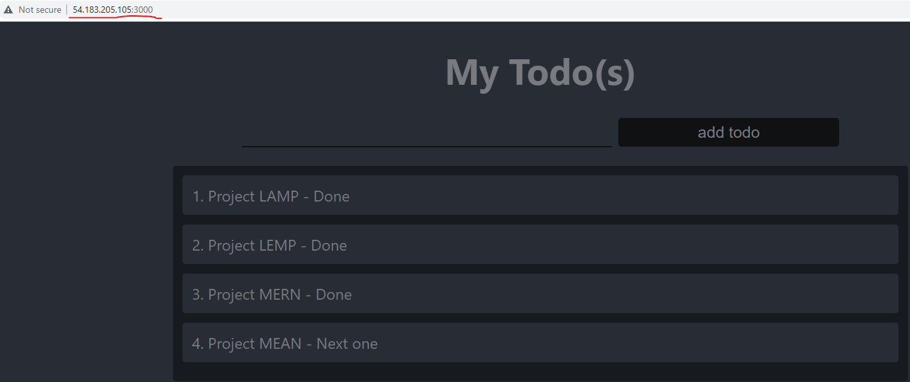

