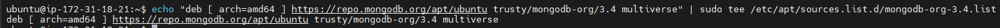
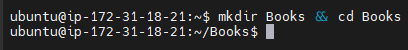

#
# MEAN STACK DEPLOYMENT TO UBUNTU IN AWS
#
### MEAN Stack is a combination of following components:
### MongoDB (Document database) – Stores and allows to retrieve data.
### Express (Back-end application framework) – Makes requests to Database ## for Reads and Writes.
### Angular (Front-end application framework) – Handles Client and Server Requests
### Node.js (JavaScript runtime environment) – Accepts requests and displays results to end user
#
### Step 0 – Preparing prerequisites
### In order to complete this project you will need an AWS account and a virtual server with Ubuntu Server OS.
#
## Step 1 - Install NodeJs
* [x] Node.js is a JavaScript runtime built on Chrome’s V8 JavaScript engine. Node.js is used in this tutorial to set up the Express routes and AngularJS controllers.
    * Update ubuntu
    * ![] sudo apt update
    * 
    * Upgrade Ubuntu
    * ![] sudo apt upgrade
    * 
    * Add certificates
    * sudo apt -y install curl dirmngr apt-transport-https lsb-release ca-certificates

    curl -sL https://deb.nodesource.com/setup_12.x | sudo -E bash -
    * 
    * Install NodeJS
    * sudo apt install -y nodejs
    * 
#
## Step 2 - Install MongoDB
### MongoDB stores data in flexible, JSON-like documents. Fields in a database can vary from document to document and data structure can be changed over time. For our example application, we are adding book records to MongoDB that contain book name, isbn number, author, and number of pages.
### mages/WebConsole.gif
* Type in following command:
    * sudo apt-key adv --keyserver hkp://keyserver.ubuntu.com:80 --recv 0C49F3730359A14518585931BC711F9BA15703C6
    * 
* insert following command:
    * echo "deb [ arch=amd64 ] https://repo.mongodb.org/apt/ubuntu trusty/mongodb-org/3.4 multiverse" | sudo tee /etc/apt/sources.list.d/mongodb-org-3.4.list
    * 
* Install MongoDB
    * sudo apt install -y mongodb
    * 
* Start The server
    * sudo service mongodb start
    * 
    * No error messages, continue with next command
* Verify that the service is up and running
    * sudo systemctl status mongodb
    * 
* Install npm – Node package manager
    * sudo apt install -y npm
    * 
* Install body-parser package
    * We need ‘body-parser’ package to help us process JSON files passed in requests to the server.
    * sudo npm install body-parser
    * 
* Create a folder named ‘Books’
    * mkdir Books && cd Books
    * 
* In the Books directory, Initialize npm project
    * npm init
    * 
* Add a file to it named server.js
    * vi server.js
    * 
#
## INSTALL EXPRESS AND SET UP ROUTES TO THE SERVER
## Step 3 - Install Express and set up routes to the server
* We also will use Mongoose package which provides a straight-forward, schema-based solution to model your application data. We will use Mongoose to establish a schema for the database to store data of our book register.
    * sudo npm install express mongoose
    * 
* In ‘Books’ folder, create a folder named apps
    * mkdir apps && cd apps
    * 
* Create a file named routes.js
    * vi routes.js
    * 
* In the ‘apps’ folder, create a folder named models
    * mkdir models && cd models
    * 
* Create a file named book.js
    * vi book.js
    * Copy and paste the code below into the "book.js"
        * 
#
## Step 4 - Access the routes with AngularJS
### AngularJS provides a web framework for creating dynamic views in your web applications. In this tutorial, we use AngularJS to connect our web page with Express and perform actions on our book register.
* Change the directory back to ‘Books’
    * cd ../..
* Create a folder named public
    * mkdir public && cd public
    * 
* Add a file named script.js
    * vi script.js
    * 
* In public folder, create a file named index.html
    * vi index.html
    * into index.html 
    * 
* Change the directory back up to Books
    * cd ..
* Start the server by running this command:
    * node server.js
    * 
    * re run some other installations carefully and was able to configure more than the first time: Add certificates, and MongoDB install commands worked better 
    * faced another issue installing npm Node package manager
        * E: Unable to correct problems, you have held broken packages.
        * https://linuxpip.org/fix-unable-to-correct-problems-you-have-held-broken-packages/s
        * sudo apt update
        * sudo apt upgrade
        * sudo apt-get autoremove
    * then install the search and install the dependency again
        * sudo apt search npm
        * sudo apt install npm
* Change the directory back up to Books
    * cd ..
* Start the server by running this command
    * node server.js
* The server is now up and running, we can connect it via port 3300. You can launch a separate Putty or SSH console to test what curl command returns locally.
     * curl -s http://localhost:3300
* Open TCP port 3300 in your AWS Web Console for your EC2 Instance
    * 
* This is how your Web Book Register Application will look like in browser:
    * 
    * 
    

