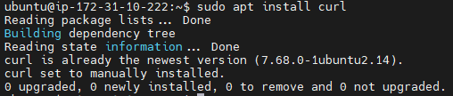

#
## CLIENT-SERVER ARCHITECTURE WITH MYSQL
#
### Understanding Client-Server Architecture
* Client-Server refres to an architecture in which two or more computers are connected together over a network to send and receive requests between one another.
* In their communication, each machine has its own role: the machine sending requests is usually referred as "Client" and the machine responding (serving) is called "Server"
* [Client-Server architecture](https://en.wikipedia.org/wiki/Client%E2%80%93server_model)
* Esample of Web Client-Server below:

* a machine that is trying to access a Web site using Web browser or simply ‘curl’ command is a client and it sends HTTP requests to a Web server (Apache, Nginx, IIS or any other) over the Internet
* If we extend this concept further and add a Database Server to our architecture, see image below:

* In this case, our Web Server has a role of a "Client" that connects and reads/writes to/from a Database (DB) Server (MySQL, MongoDB, Oracle, SQL Server or any other), and the communication between them happens over a Local Network (it can also be Internet connection, but it is a common practice to place Web Server and DB Server close to each other in local network).
* The setup on the diagram above is a typical generic Web Stack architecture that you have already implemented in previous projects (LAMP, LEMP, MEAN, MERN), this architecture can be implemented with many other technologies – various Web and DB servers, from small Single-page applications SPA to large and complex portals.
#
### Configure WebClient-Server
* sudo apy update
* sudo apt upgrade
* Installint Curl
    * sudo apt install curl
    
* Open up your Ubuntu or Windows terminal and run curl command
    *  curl -Iv www.propitixhomes.com
    
#
### IMPLEMENT A CLIENT SERVER ARCHITECTURE USING MYSQL DATABASE MANAGEMENT SYSTEM (DBMS)
### To demonstrate Client-Server architecture we will be using two Ec2 instance with mysql-server and mysql-client respectively
* Name one instance MySQL-SERVER to other MySQL-Client
    * Create and configure two Linux-based virtual servers (EC2 instances in AWS).
    * Note: Make sure they are both in same subnet
    
### On MySQL-Server Linux server install MySQL Server Software
* sudo apt update
* sudo apt upgrade -y
* sudo apt install mysql-server -y
    
    
### On MySQL-Client Linux server install MySQL Server Software
* 
* Open port 3306 on MySQL-Server allow for connection. Both servers can comunicate using private IPs sunce they belong to the same subnet

5. Xonfigure MySQL-Server to allow connections from remote hosts
    * sudo vi /etc/mysql/mysql.conf.d/mysqld.cnf
    * Replace 127.0.0.1 to 0.0.0.0 like this
    * Original Connection Configuration 
    
    * New Connection Configuration
    
#
* Configure MySQL-Server and create database and user
    * sudo mysql
    
    * Authtntication
    

    * sudo mysql_secure_installation
    
    
    
* Create a new DataBase
    
* Create a new user 
    
* Grant all permissions on databases
    
* error message
    
* Problem I was not including the hostname of the server 
* Sample: sudo mysql -h <> -u <> -p
* Solution:

