#
## DEVOPS TOOLING WEBSITE SOLUTION
### In this project you will implement a solution that consists of following components:

### 1) Infrastructure: AWS
### 2) Webserver Linux: Red Hat Enterprise Linux 9
### 3) Database Server: Ubuntu 20.04 + MySQL
### 4) Storage Server: Red Hat Enterprise Linux 9 + NFS Server
### 5) Programming Language: PHP
### 6) Code Repository: [GitHub-tooling](https://github.com/darey-io/tooling)
#
### On the diagram below you can see a common pattern where several stateless Web Servers share a common database and also access the same files using Network File Sytem (NFS) as a shared file storage. Even though the NFS server might be located on a completely separate hardware – for Web Servers it look like a local file system from where they can serve the same files.
#
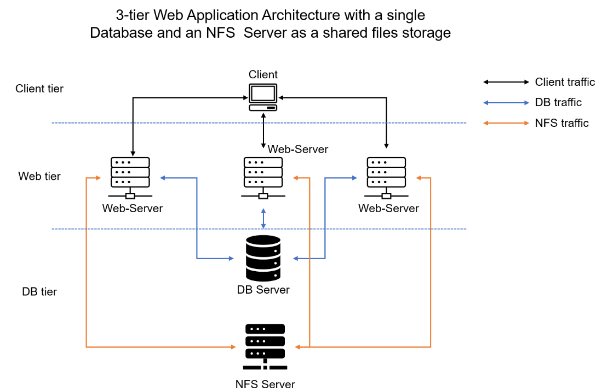
### It is important to know what storage solution is suitable for what use cases, for this – you need to answer following questions: what data will be stored, in what format, how this data will be accessed, by whom, from where, how frequently, etc. Base on this you will be able to choose the right storage system for your solution.
# STEP 1. PREPARE NFS SERVER
# Step 1. Prepare NFS Server
### 1. Spin up a new EC2 instance with RHEL Linux 9 Operating System
### (AWS supports Linux 9 at the moment)
### Attach all three volumes one by one to your NFS Server EC2 instance
### On Web server attached the 3 volumes
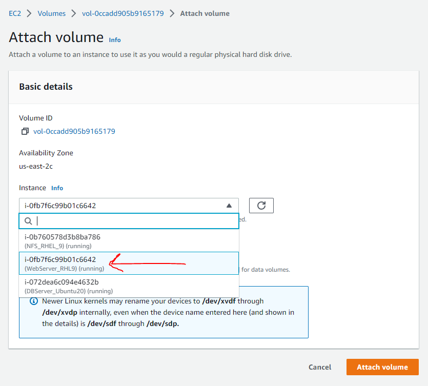
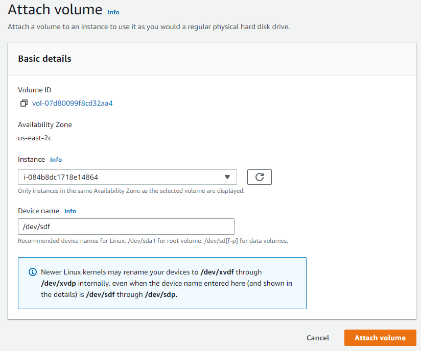
### - Use [lsbk](https://man7.org/linux/man-pages/man8/lsblk.8.html) command to inspect what block devices are attached to the Web server.
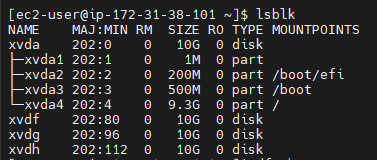
### Inspect it with ls /dev/ and make sure you see all 3 newly created block devices there – their names will likely be xvdf, xvdh, xvdg.
### - Use df -h command to se all mounts and free sapce on your server
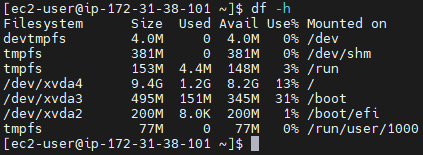
### - Use gdisk utility to create a single partition on each of the 3 disks
###     sudo gdisk /dev/xvdf
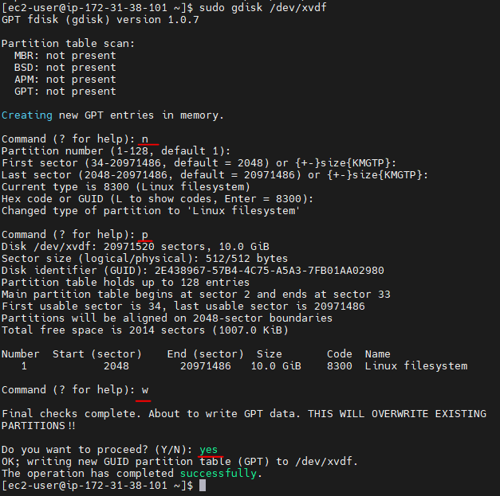
###     sudo gdisk /dev/xvdg
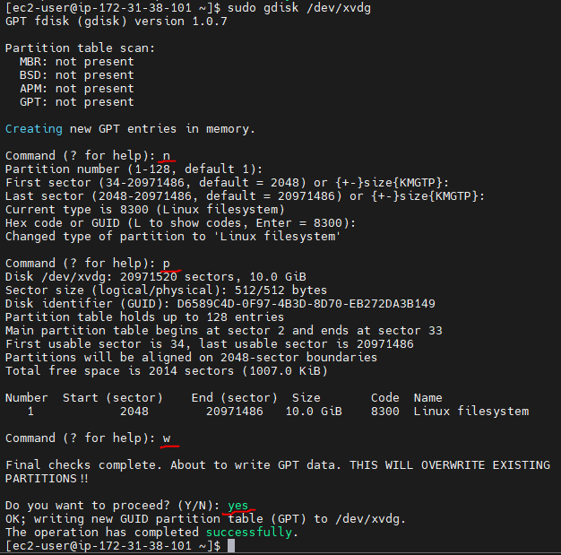
###     sudo gdisk /dev/xvdh
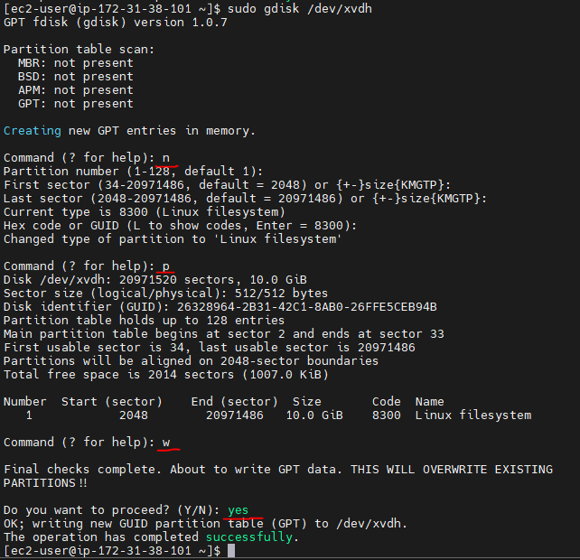
###     Use lsblk utility to view the newly configured partition on each of the 3 disks

#
### 2. Install lvm2 package using sudo yum install lvm2. 
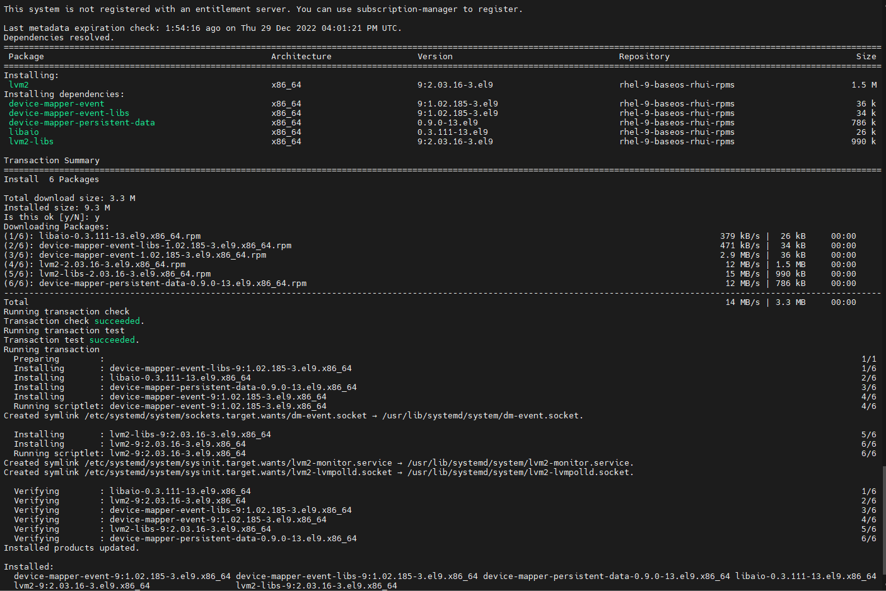
### Run sudo lvmdiskscan command to check for available partitions.
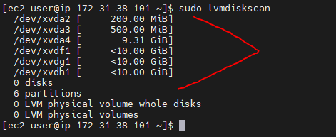
###     Use [pvcreate](https://linux.die.net/man/8/pvcreate) utility to mark each of 3 disks as physical volumes (PVs) to be used by LVM
### sudo pvcreate /dev/xvdf1
### sudo pvcreate /dev/xvdg1
### sudo pvcreate /dev/xvdh1
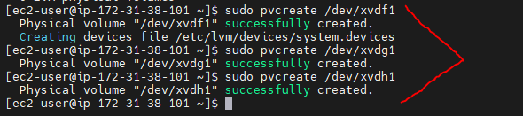
###     Verify that your Physical volume has been created successfully by running sudo pvs
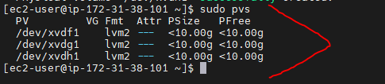
### Use vgcreate utility to ensure there are 3 Logical Volumes. lv-opt lv-apps, and lv-logs
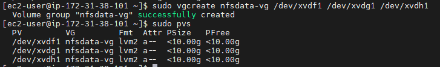
### Use lvcreate utility to create 2 logical volumes. apps-lv (Use half of the PV size), ensure there are 3 Logical Volumes. lv-opt lv-apps, and lv-logs

### Verify the entire setup
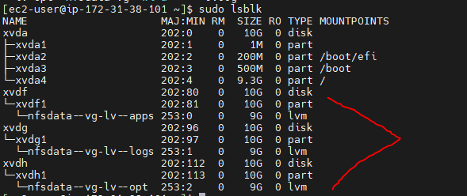
### Instead of formating the disks as ext4 you will have to format them as xfs
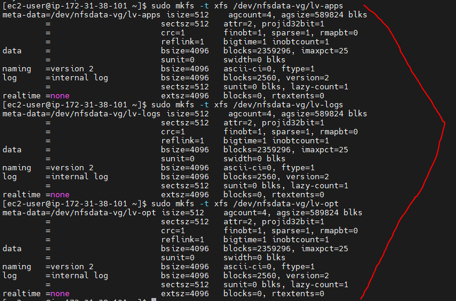
### Create mount points on /mnt directory for the logical volumes as follow:
### sudo mkdir -p /mnt/apps
### sudo mkdir -p /mnt/logs
### sudo mkdir -p /mnt/opt
### mount lv-apps on /mnt/apps – To be used by webservers
### mount lv-logs on /mnt/logs – To be used by webserver logs
### mount lv-opt on /mnt/opt – To be used by Jenkins server in Project 8
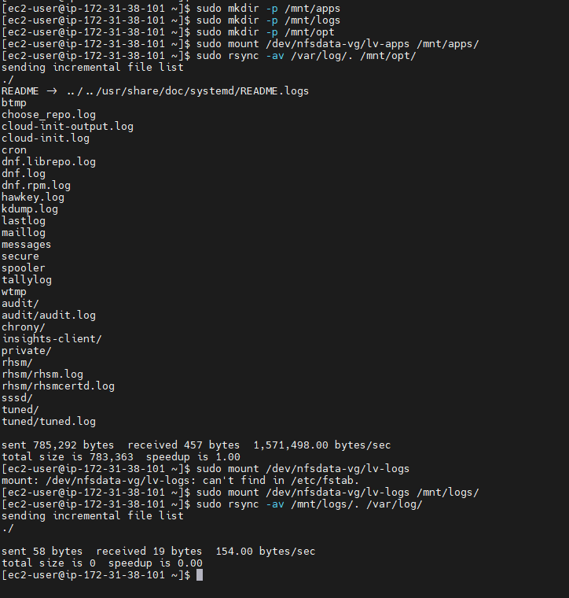
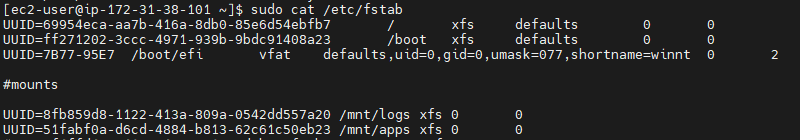

### sudo vi /etc/fstab
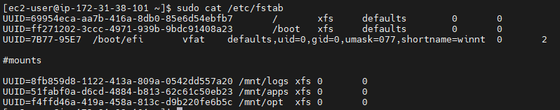

## Verification
### sudo mount -a
### sudo systemctl daemon-reload
### sudo df -h

# Prepare DB Server
## Launch a second EC2 instance (Ubuntu) that will have a role "DB Server"
### Repeat the same steps as for the Web Server, but instead of lv-apps create lv-db and mount it to /db directory instead of /mnt/apps
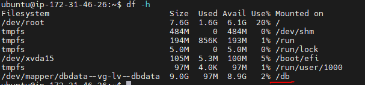
#
## 3. Install NFS server, configure it to start on reboot and make sure it is u and running
### - sudo yum -y update
### - sudo yum install nfs-utils -y
### - sudo systemctl start nfs-server.service
### - sudo systemctl enable nfs-server.service
### - sudo systemctl status nfs-server.service
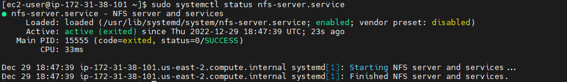
### 4. Export the mounts for webservers’ subnet cidr to connect as clients. For simplicity, you will install your all three Web Servers inside the same subnet, but in production set up you would probably want to separate each tier inside its own subnet for higher level of security.
### To check your subnet cidr – open your EC2 details in AWS web console and locate ‘Networking’ tab and open a Subnet link:
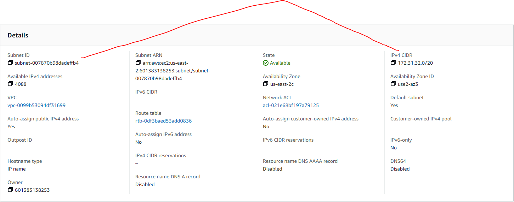
### - Make sure we set up permission that will allow our Web servers to read, write and execute files on NFS:
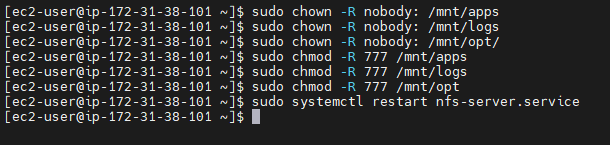
### Configure access to NFS for clients within the same subnet (example of Subnet CIDR – 172.31.32.0/20 ):
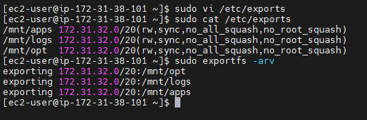
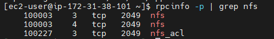
### 5. Check which port is used by NFS and open it using Security Groups (add new Inbound Rule)
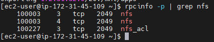
### Important note: In order for NFS server to be accessible from your client, you must also open following ports: TCP 111, UDP 111, UDP 2049
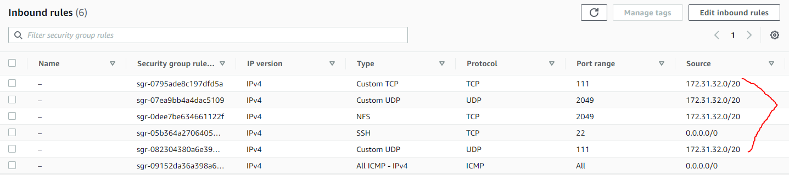

#
# Step 2. Preparing Database Server
### Create an Ubuntu Server on AWS which will server as our Database. Ensure its in the same subnet as the NFS Server
### sudo apt -y update
### sudo apt install -y mysql-server
### To enter the db environment run
### sudo mysql
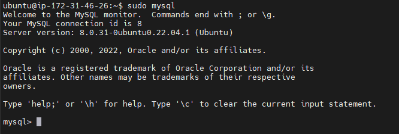
### - Create database name it "tooling"
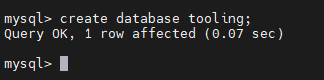
### Create a database user and name it webaccess
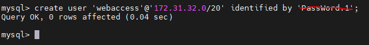
### - Grant permission to webaccess user on tooling database to do anything only from the webservers subnet cidr
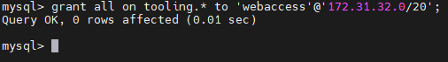
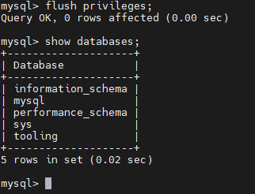

# Step 3. Prepare the Web Servers
### We need to make sure that our Web Servers can serve the same content from shared storage solutions, in our case – NFS Server and MySQL database.
### You already know that one DB can be accessed for reads and writes by multiple clients. For storing shared files that our Web Servers will use – we will utilize NFS and mount previously created Logical Volume lv-apps to the folder where Apache stores files to be served to the users (/var/www).

### This approach will make our Web Servers stateless, which means we will be able to add new ones or remove them whenever we need, and the integrity of the data (in the database and on NFS) will be preserved.

### During the next steps we will do following:

### Configure NFS client (this step must be done on all three servers)
### Deploy a Tooling application to our Web Servers into a shared NFS folder
### Configure the Web Servers to work with a single MySQL database
### 1. Launch a new EC2 instance with RHEL 9 Operating System
### 2. Install NFS client
### sudo yum install nfs-utils nfs4-acl-tools -y
### 3. Mount /var/www/ and target the NFS server’s export for apps
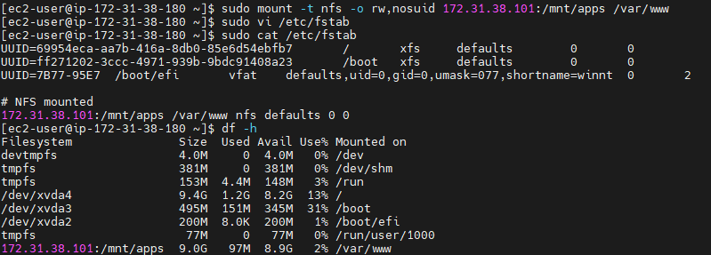
### We then need to ensure that our mounts remain intact when the server reboots. This is achieved by configuring the fstab directory.
### sudo vi /etc/fstab
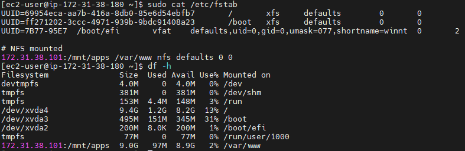
### 4. Install Remi’s repository, Apache and PHP
### sudo yum -y update
### sudo yum -y install wget httpd php php-mysqlnd php-fpm php-json
### sudo dnf install https://dl.fedoraproject.org/pub/epel/epel-release-latest-9.noarch.rpm
### sudo dnf install dnf-utils http://rpms.remirepo.net/enterprise/remi-release-9.rpm
### sudo dnf module reset php
### sudo dnf module enable php:remi-7.4
### sudo dnf install php php-opcache php-gd php-curl php-mysqlnd
### sudo systemctl start php-fpm
### sudo systemctl enable php-fpm
### sudo setsebool -P httpd_execmem 1
### sudo systemctl restart httpd
### sudo systemctl status httpd
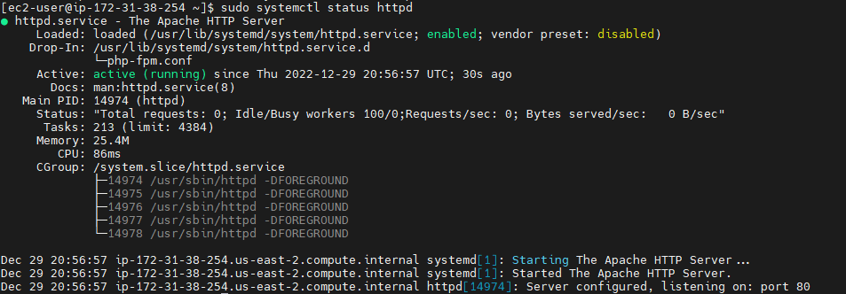
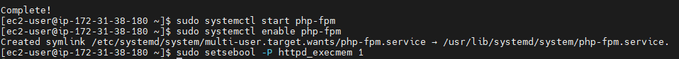
### Repeat steps 1-5 for another 2 Web Servers
#
### 6. Verify that Apache files and directories are available on the Web Server in /var/www and also on the NFS server in /mnt/apps. If you see the same files – it means NFS is mounted correctly. You can try to create a new file touch test.txt from one server and check if the same file is accessible from other Web Servers.
#
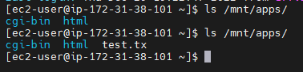
#
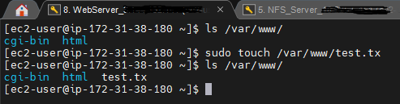
#
### 7. Locate the log folder for Apache on the Web Server and mount it to NFS server’s export for logs. Repeat step №4 to make sure the mount point will persist after reboot.
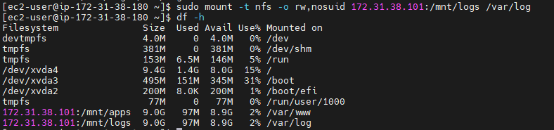
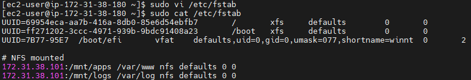
### 8. Fork the tooling source code from Darey.io Github Account to your Github account. (Learn how to fork a repo here)
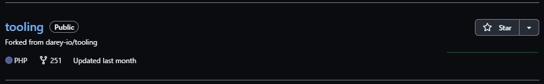
### 9. Deploy the tooling website’s code to the Webserver. Ensure that the html folder from the repository is deployed to /var/www/html

### Note 1: Do not forget to open TCP port 80 on the Web Server.
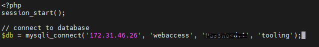
### Update the website’s configuration to connect to the database (in /var/www/html/functions.php file).
### Create in MySQL a new admin user with username: myuser and password: password:
### sudo yum install mysql
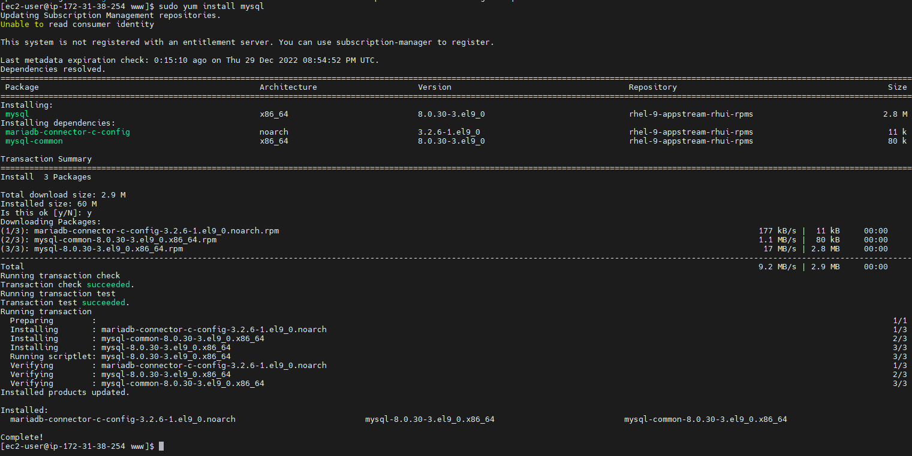
### Update the bind-address to 0.0.0.0
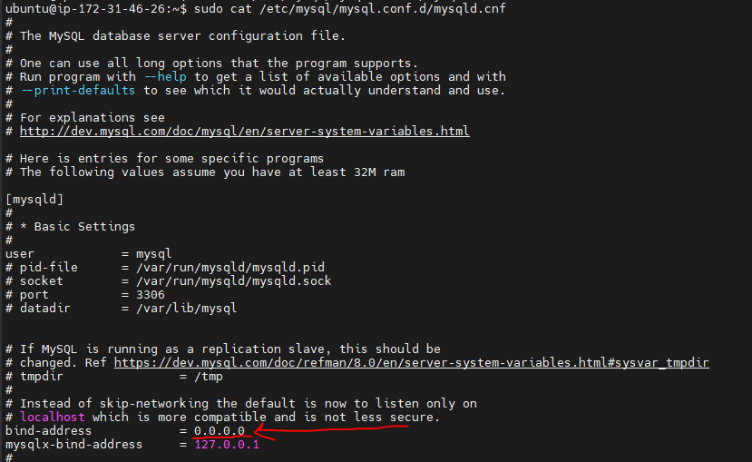
### Apply tooling-db.sql script to your database using this command 
### mysql -h <databse-private-ip> -u <db-username> -p <db-pasword> < tooling-db.sql
### issue faced: cannot connect to DB server (unable to ping it)
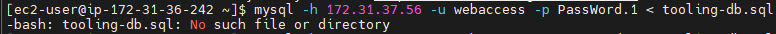
## Resolution:[website to resolve the issue](https://arcadian.cloud/aws/2022/07/01/4-reasons-you-cannot-ping-your-aws-ec2-instance-and-how-to-fix-them/)

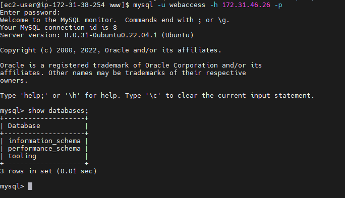
### Create in MySQL a new admin user with username: myuser and password: password:
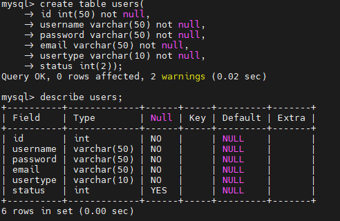
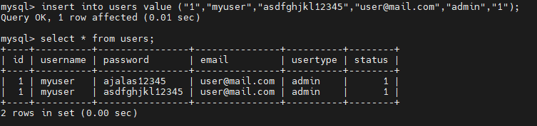
### Open the website in your browser http://<Web-Server-Public-IP-Address-or-Public-DNS-Name>/index.php and make sure you can login into the websute with myuser user.
### Issue 1. Try to open the website
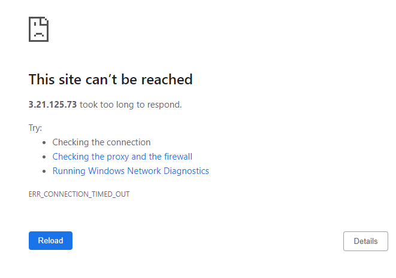
### A possible solution : restart the Apache service. 
### Did not work, see solution below worked for this case.
### 1. Apache service failed to start.
### Solution: 
### step1. remove apache and php dependencies
### sudo dnf remove httpd -y
### step2. [Install LAMP Stack on CentOS 9 RHEL 9](https://technixleo.com/install-lamp-stack-on-centos-alma-rhel/)
### step1. sudo dnf update -y
### step2. sudo reboot
### step3. sudo dnf install httpd httpd-tools -y
### step4. "sudo systemctl start httpd" , then "sudo systemctl enable httpd"
### step5. install PHP and it's dependencies
### sudo yum install https://dl.fedoraproject.org/pub/epel/epel-release-latest-9.noarch.rpm -y
### sudo yum install yum-utils http://rpms.remirepo.net/enterprise/remi-release-9.rpm -y
### sudo yum module list php
### sudo yum module reset php
### sudo yum module enable php:remi-7.4
### sudo yum install php php-opcache php-gd php-curl php-mysqlnd
### sudo systemctl start php-fpm
### sudo systemctl enable php-fpm
### sudo setsebool -P httpd_execmem 1
### Continuing resolving the original issue. The website can't be reached
### Resolution: 
### command: sudo setenforce 0
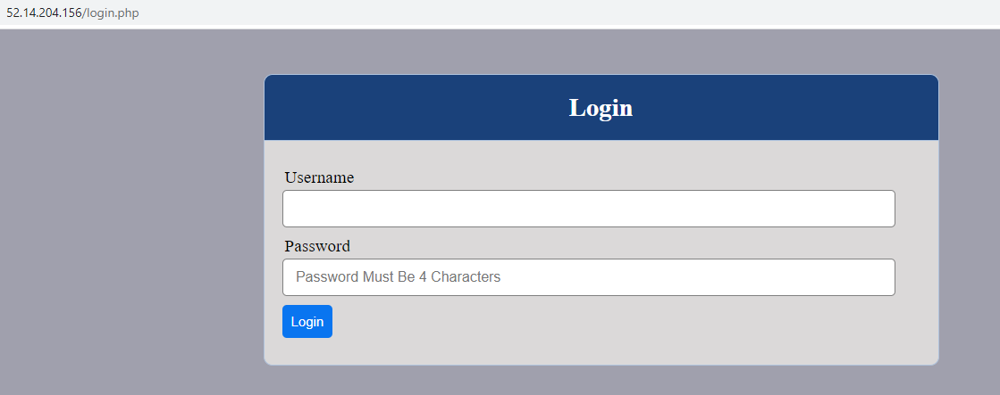
