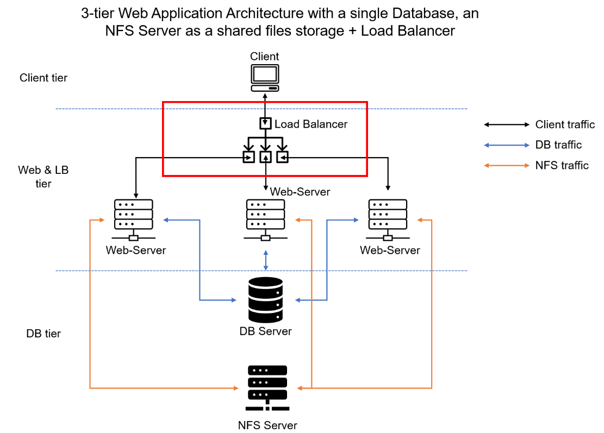
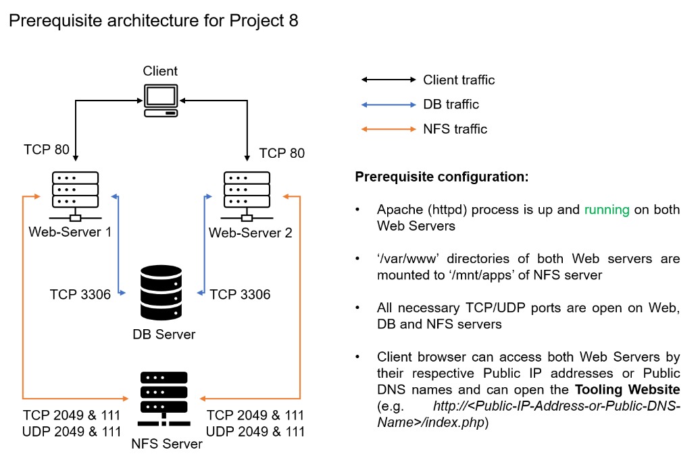
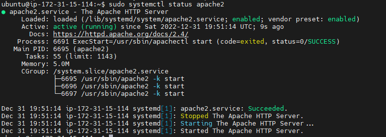
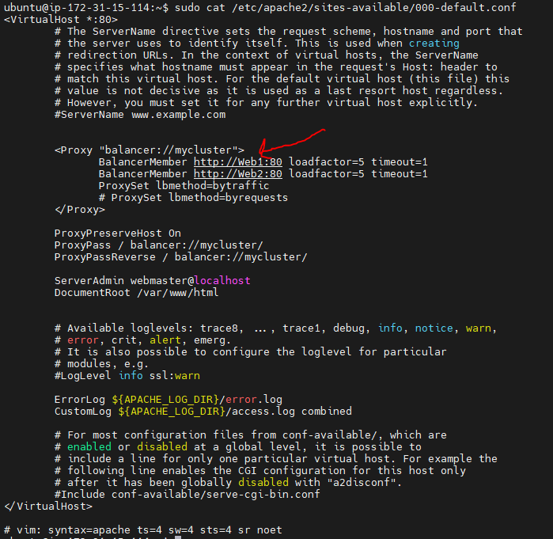
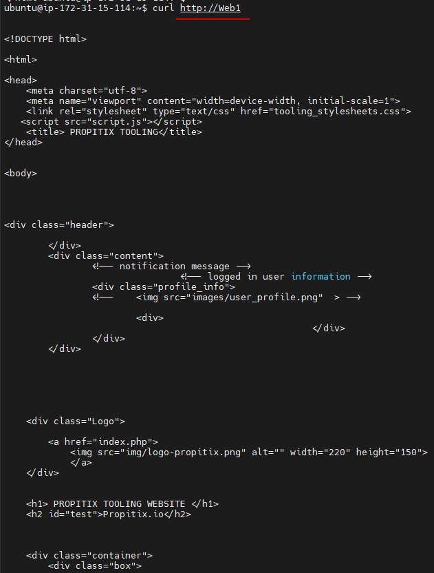
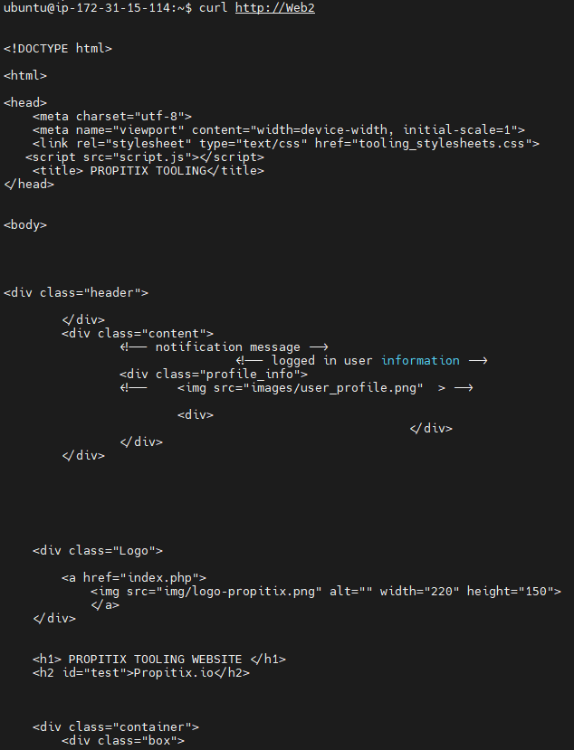
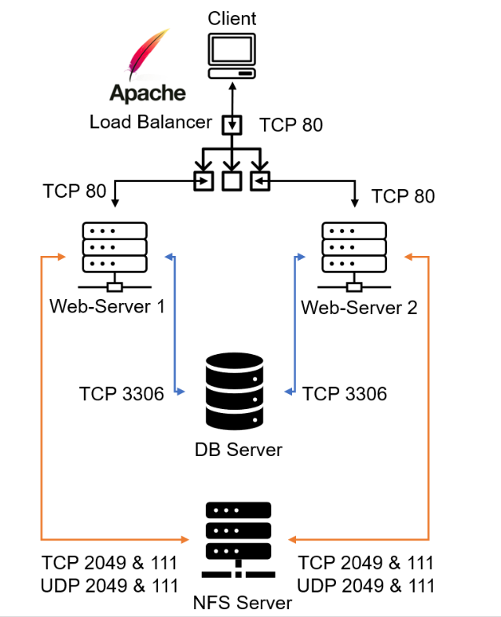

#
# PROJECT 8: LOAD BALANCER SOLUTION WITH APACHE
### After completing Project-7 you might wonder how a user will be accessing each of the webservers using 3 different IP addreses or 3 different DNS names. You might also wonder what is the point of having 3 different servers doing exactly the same thing.
### When we access a website in the Internet we use an URL and we do not really know how many servers are out there serving our requests, this complexity is hidden from a regular user, but in case of websites that are being visited by millions of users per day (like Google or Reddit) it is impossible to serve all the users from a single Web Server (it is also applicable to databases, but for now we will not focus on distributed DBs).
### Each URL contains a domain name part, which is translated (resolved) to IP address of a target server that will serve requests when open a website in the Internet. Translation (resolution) of domain names is perormed by DNS servers, the most commonly used one has a public IP address 8.8.8.8 and belongs to Google. You can try to query it with nslookup command:

### nslookup 8.8.8.8
### Server:  UnKnown
### Address:  103.86.99.99

### Name:    dns.google
### Address:  8.8.8.8

### When you have just one Web server and load increases – you want to serve more and more customers, you can add more CPU and RAM or completely replace the server with a more powerful one – this is called "vertical scaling". This approach has limitations – at some point you reach the maximum capacity of CPU and RAM that can be installed into your server.

### Another approach used to cater for increased traffic is "horizontal scaling" – distributing load across multiple Web servers. This approach is much more common and can be applied almost seamlessly and almost infinitely (you can imagine how many server Google has to serve billions of search requests).

### Horizontal scaling allows to adapt to current load by adding (scale out) or removing (scale in) Web servers. Adjustment of number of servers can be done manually or automatically (for example, based on some monitored metrics like CPU and Memory load).

### Property of a system (in our case it is Web tier) to be able to handle growing load by adding resources, is called ["Scalabitiy"](https://en.wikipedia.org/wiki/Scalability)

### In the setup of the Project-7 we had 3 Web Servers and each of them had its own public IP address and public DNS name. A client has to access them by using different URLs, which is not a nice user experience to remember addresses/names of even 3 server, let alone millions of [Google Servers](https://en.wikipedia.org/wiki/Google_data_centers)
### Study concepts: 
### - [Load Balance](https://www.nginx.com/resources/glossary/load-balancing/)
### - [L4 Networsk LB](https://www.nginx.com/resources/glossary/layer-4-load-balancing/)
### - [L7 Application LB](https://www.nginx.com/resources/glossary/layer-7-load-balancing/)
### In this project we will enhance our Tooling Website solution by adding a Load Balancer to disctribute traffic between Web Servers and allow users to access our website using a single URL.
#

## Task
### Deploy and configure an Apache Load Balancer for Tooling Website solution on a separate Ubuntu EC2 intance. Make sure that users can be served by Web servers through the Load Balancer.

### To simplify, let us implement this solution with 2 Web Servers, the approach will be the same for 3 and more Web Servers.

### Instructions On How To Submit Your Work For Review And Feedback
# 
## Prerequisites
### Make sure that you have following servers installed and configured within Project-7:

### 1. Two RHEL8 Web Servers
### 2. One MySQL DB Server (based on Ubuntu 20.04)
### 3. One RHEL8 NFS server

#
## CONFIGURE APACHE AS A LOAC BALANCER
### Configure Apache As A Load Balancer
### 1. Create and Ubuntu Server 20.04 EC2 instance and name it Project-8-apache-lb, so your EC2 list will look like this:

### 2. Open TCP port 80 on Project-8-apache-lb by creating an Inbound Rule in Security Group

### 3. Install Apache Load Balancer on Project-8-apache-lb server and configure it to point traffic coming to LB to both Web Servers:
### - Install apache2
### sudo apt update
### sudo apt install apache2 -y
### sudo apt-get install libxml2-dev
### - Enable following modules:
### sudo a2enmod rewrite
### sudo a2enmod proxy
### sudo a2enmod proxy_balancer
### sudo a2enmod proxy_http
### sudo a2enmod headers
### sudo a2enmod lbmethod_bytraffic
### - Restart apache2 service
### sudo systemctl restart apache2
### - Make sure apache2 is up and running
### sudo systemctl status apache2

### - Configure load balancing
### sudo vi /etc/apache2/sites-available/000-default.conf
### #Add this configuration into this section <VirtualHost *:80>  </VirtualHost>

### Restart apache server
### sudo systemctl restart apache2

### [bytraffic](https://httpd.apache.org/docs/2.4/mod/mod_lbmethod_bytraffic.html) balancing method will distribute incoming load between your Web Servers according to current traffic load. We can control in which proportion the traffic must be distributed by loadfactor parameter.
### You can also study and try other methods, like: [bybusyness](https://httpd.apache.org/docs/2.4/mod/mod_lbmethod_bybusyness.html), [byrequests](https://httpd.apache.org/docs/2.4/mod/mod_lbmethod_byrequests.html), [heartbeat](https://httpd.apache.org/docs/2.4/mod/mod_lbmethod_heartbeat.html)
### 4. Verify that our configuration works – try to access your LB’s public IP address or Public DNS name from your browser:
### http://<Load-Balancer-Public-IP-Address-or-Public-DNS-Name>/index.php

### Note: If in the Project-7 you mounted /var/log/httpd/ from your Web Servers to the NFS server – unmount them and make sure that each Web Server has its own log directory.
### Open two ssh/Putty consoles for both Web Servers and run following command:
### Web1:

### LB:

### Try to refresh your browser page http://<Load-Balancer-Public-IP-Address-or-Public-DNS-Name>/index.php several times and make sure that both servers receive HTTP GET requests from your LB – new records must appear in each server’s log file. The number of requests to each server will be approximately the same since we set loadfactor to the same value for both servers – it means that traffic will be disctributed evenly between them.
### If you have configured everything correctly – your users will not even notice that their requests are served by more than one server.
### Study Concepts
### Read more about different configuration aspects of Apache mod_proxy_balancer module. Understand what sticky session means and when it is used.
#
## Configure Local DNS Names Resolution
### Sometimes it is tedious to remember and switch between IP addresses, especially if you have a lot of servers under your management.
### What we can do, is to configure local domain name resolution. The easiest way is to use /etc/hosts file, although this approach is not very scalable, but it is very easy to configure and shows the concept well. So let us configure IP address to domain name mapping for our LB.
### - Open this file on your LB server
### sudo vi /etc/hosts

### Now you can update your LB config file with those names instead of IP addresses.

### You can try to curl your Web Servers from LB locally curl http://Web1 or curl http://Web2 – it shall work.

### Remember, this is only internal configuration and it is also local to your LB server, these names will neither be ‘resolvable’ from other servers internally nor from the Internet.

### Congratulations - You have just implemented a Load balancing Web Solution for your DevOps team.

