#
## It is time to start getting a feel of how to automate some work using Shell Scripts.
## In this project, you need to onboard 20 new Linux users onto a server. Create a shell script that reads a csv file that contains the first name of the users to be onboarded.
#
### 
1. Create the project folder called Shell
    * mkdir Shell
    * 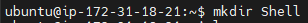
* Move into the Shell directory
    * cd Shell
    * 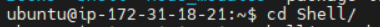
2. Create a csv dile name names.csv
    * touch names.csv
    * 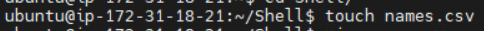
    * Open the names.csv file
    * 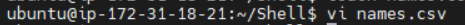
3. The script you created should read the CSV file, create each user on the server, and add to an existing group called developers (You will need to manually create this group ahead)
4. Ensure that your script will first check for the existence of the user on the system, before it will attempt to create that it
5. Ensure that the user that is being created also has a default home folder
6. Ensure that each user has a .ssh folder within its HOME folder. If it does not exist, then create it
7. For each user’s SSH configuration, create an authorized_keys file and add ensxure it has the public key of your current user
    * Before Deploying your script, you will need to update your current user with the correct public key and private key
        * In your current home directory change directo .ssh folder
        * 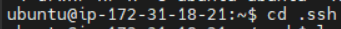
    * create a file for the public key
        * touch id_rsa.pub
        * 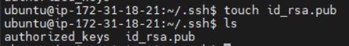
    * open the file using your favorite editor and paste in the public key
        * vi id_rsa.pub
        * 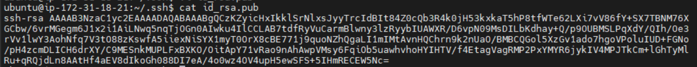
#
#
# Tasks
### 1. Create a git repository and name it auxiliary-projects
* 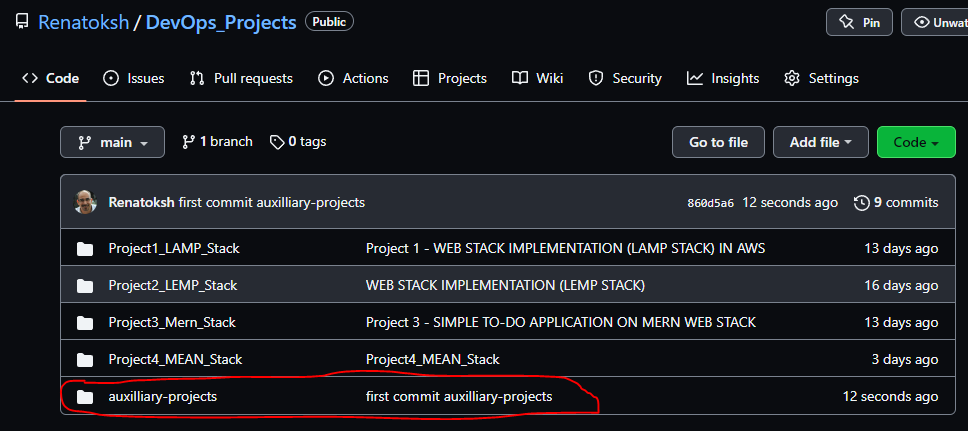
#
### 2. Name your shell script onboarding users
* 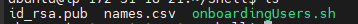
#
### 3. Screen record your work, and demo how you have onboarded users onto the server
* 
* Shell directory created
* id_rsa.pub file created under Shell directory
    *
* csv file that includes the user names created
    * 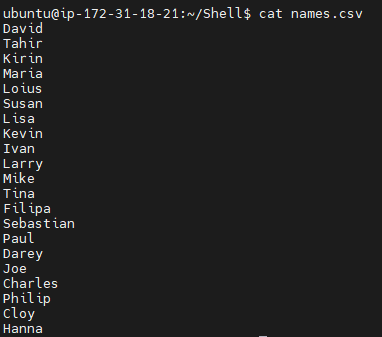
* onboarding users.sh file created
    * 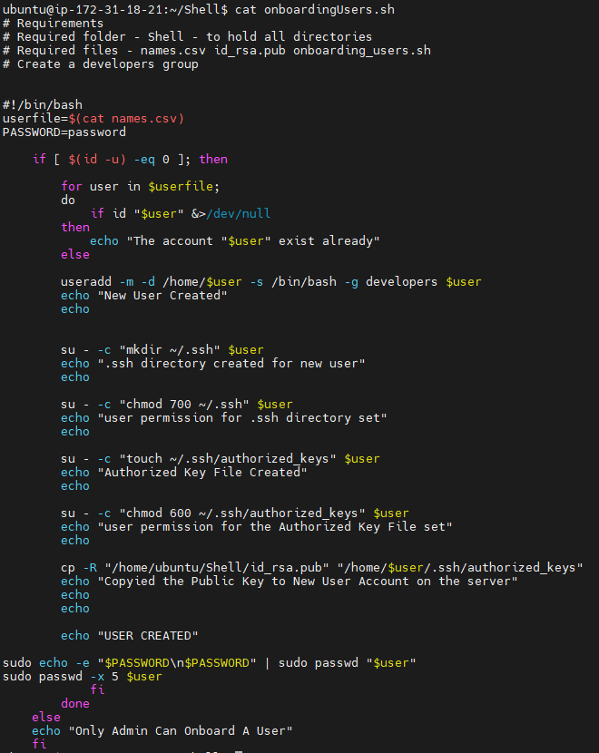

#
### Adding Users
* 
* 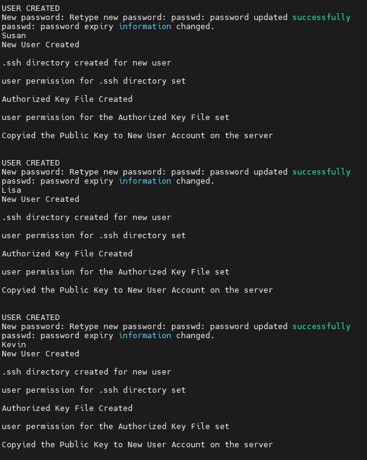
* 
* 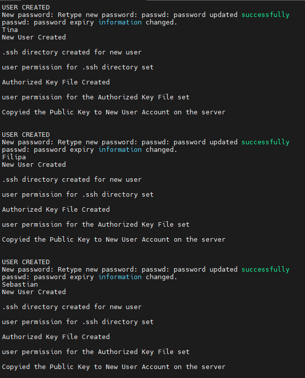
* 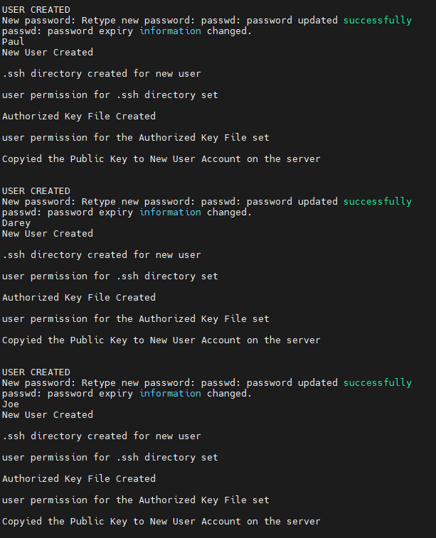
* 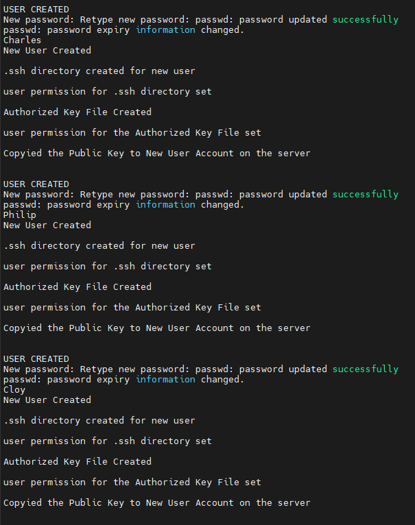
* 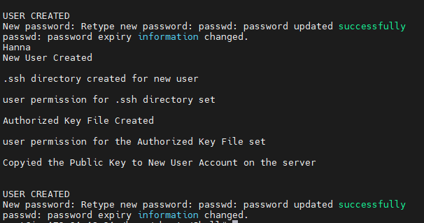
#
### home users created
* 
#
### Another user connectivity
* 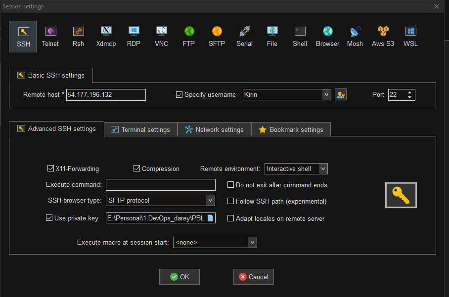
* 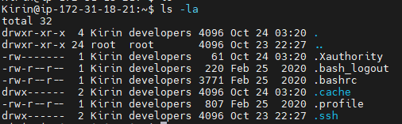

